# ToanHocHay — Online Math Learning Platform for Grade 6

> Learn Grade 6 mathematics along the official textbook curriculum, with a **step-by-step AI tutor**,
> **visual progress tracking** for students, and a **dashboard for parents and teachers**.

<!-- Badges: point the CI/license links at your own repo -->


---

## Table of contents

- [Why this project exists](#why-this-project-exists)
- [What ToanHocHay does](#what-toanhochay-does)
- [Core flows](#core-flows)
- [Features](#features)
- [Architecture & tech stack](#architecture--tech-stack)
- [Getting started](#getting-started)
- [Configuration](#configuration)
- [Seed accounts & sample data](#seed-accounts--sample-data)
- [Testing](#testing)
- [Deployment](#deployment)
- [Project layout](#project-layout)
- [Team](#team)
- [License](#license)

---

## Why this project exists

Surveying Grade 6 students, parents, and teachers, we kept running into the same three problems
when children study math:

| Student weakness | How it shows up |
|---|---|
| **Lack of focus** | Boring content, a teaching style that doesn't fit, a distracting study environment, or personal factors that make it hard to stay attentive. |
| **Trouble absorbing the material** | Getting stuck on specific problem types or abstract concepts, with no one to re-explain at the right moment. |
| **No interest in math** | Boredom leads straight to a loss of motivation. |

And here is what parents and teachers asked for:

- **More focus** — solutions that help their child concentrate while studying math.
- **Effective learning methods** — knowledge that is easier to take in and stays longer.
- **Engaging content** — lively lessons and exercises that don't feel dull.
- **Visibility and assessment** — a tool to see progress and clearly identify strengths and weaknesses.

## What ToanHocHay does

ToanHocHay is an e-learning platform focused on **Grade 6 mathematics**, following the three official
textbook series (Kết nối tri thức, Chân trời sáng tạo, Cánh diều). It addresses the problems above by:

- **Breaking the learning path into small steps** — a chapter → lesson → content-block tree
  (definitions, examples, formulas, notes, flashcards…), so students move in short steps instead of
  tackling a whole chapter at once.
- **An AI tutor right inside the exercise**: when a student is stuck, the AI gives **level-based hints**
  (never the answer outright); after submission, the AI provides a **mistake analysis and how to fix it**
  for each question.
- **Gamified practice**: study streaks, an activity heatmap, and a clear split between "free practice"
  (untimed) and "tests" (timed).
- **A student dashboard**: visualizing progress by chapter, weak topics, and a results-over-time chart.
- **Parent–student linking**: parents follow their child's progress and receive notifications
  (tab switching during a test, low scores, several days of inactivity).
- **Anti-distraction alerts**: the system records when a student leaves the test screen and sends a notification.

### What the team learned

- Designing a **defense-in-depth API** (global `[Authorize]`, resource-ownership checks, per-user
  rate limiting, a CORS allowlist) and a review / remediation process backed by regression tests.
- Integrating an **LLM (Google Gemini)** into a real product through a dedicated microservice, with a
  background queue, per-package quotas, and graceful degradation when the AI service is down.
- Building an idempotent **QR payment + webhook flow (SePay)**, subscription lifecycle management, and
  a semi-automated refund flow.
- Operating a system of **two .NET apps** (API + MVC) plus a **Python service**, packaged with Docker
  Compose and shipped via CI/CD to Azure.

---

## Core flows

> 📷 *Screenshots of each flow will be added to this section.*
> Put images under `docs/screenshots/` and replace the placeholders below.

### 1. Authentication & accounts
Register → confirm email → sign in (short-lived JWT access token + **rotating refresh token with
reuse detection**) → forgot / reset password. Temporary account lockout after repeated failed logins.

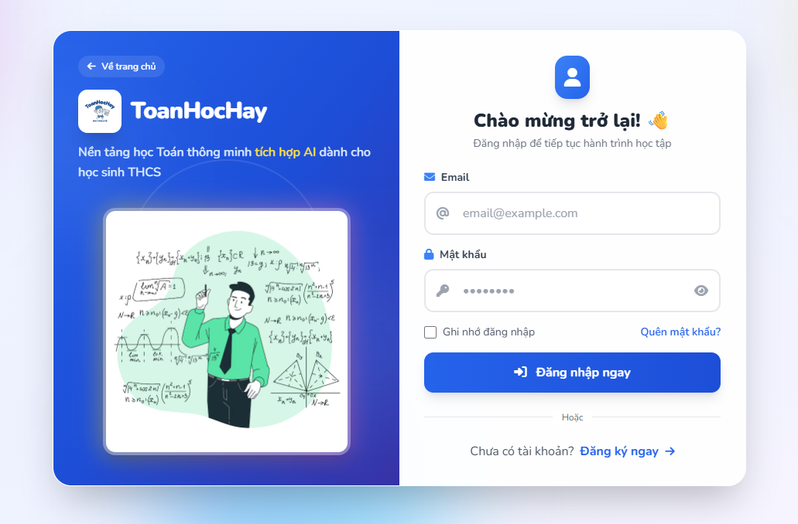

### 2. Course catalog & enrollment
Guests (not signed in) can browse the course catalog and the list of **free** exercises. Students
enroll in published courses; content is gated by **3 tiers** (free / Standard / Premium).

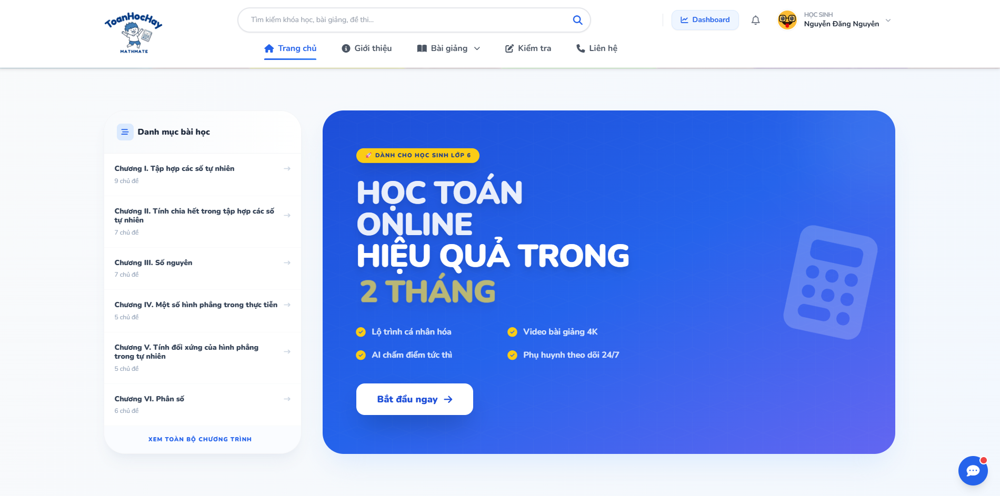

### 3. Studying lessons
A lesson is a `ContentNode` tree (chapter → lesson) made of several block types plus a flashcard deck.
Students mark each lesson complete; progress rolls up to the chapter and the whole course.

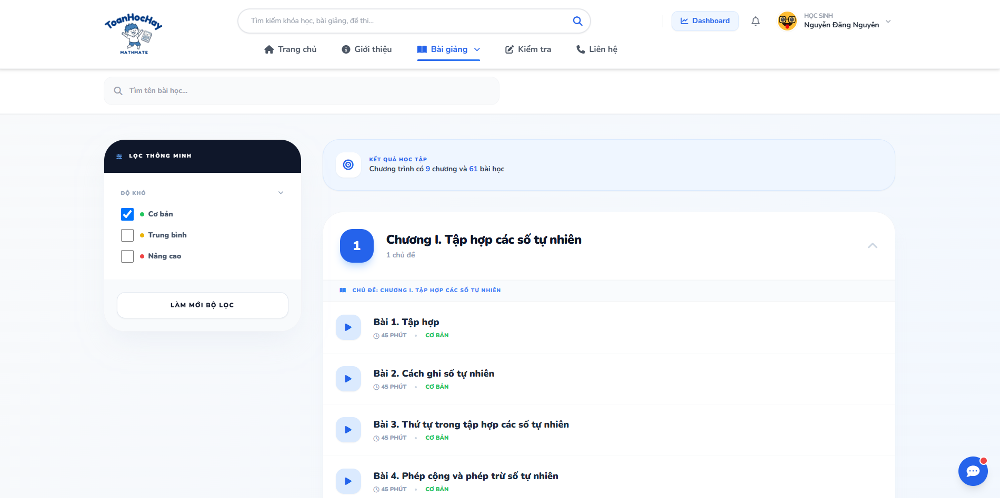

### 4. Exercises & tests
Pick an exercise → start it (package entitlement is checked) → **each answer autosaves**, so you can
leave and resume → submit → **automatic grading** (multiple choice / true-false / fill-in-the-blank).
"Practice" is untimed; "tests" run a clock based on the configured duration. Tab-switching is recorded
to deter cheating and distraction.

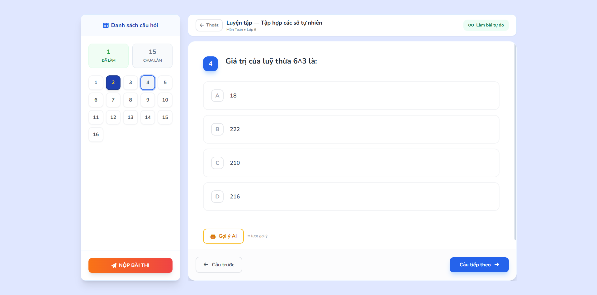

### 5. AI help & chatbot
During the exercise: **level-based AI hints** (quota depends on the package). After submission: a
background queue calls the AI to produce a **full solution + mistake analysis + advice** for wrong or
skipped questions. There is also a **marketing chatbot** on the home page.

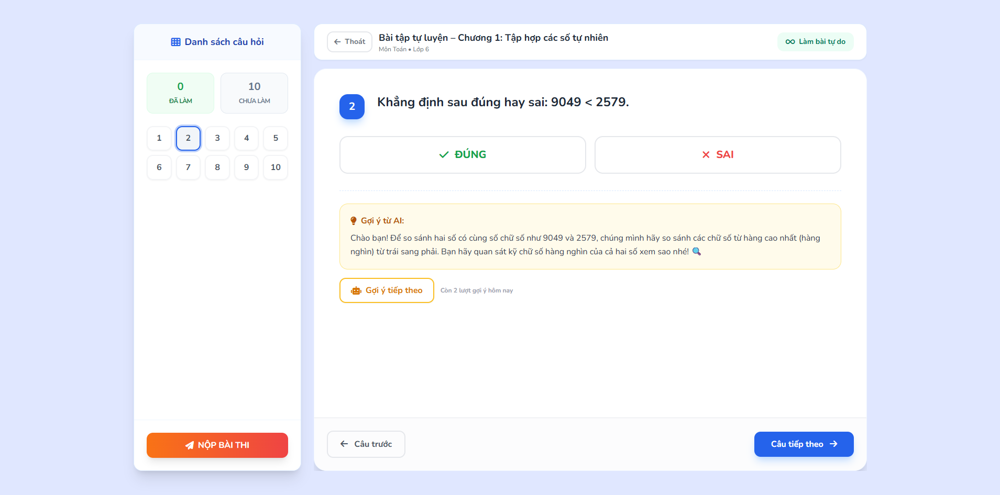

### 6. Student dashboard
An overview of progress by chapter, weak topics, study streak, an activity heatmap, and a
results-over-time chart.

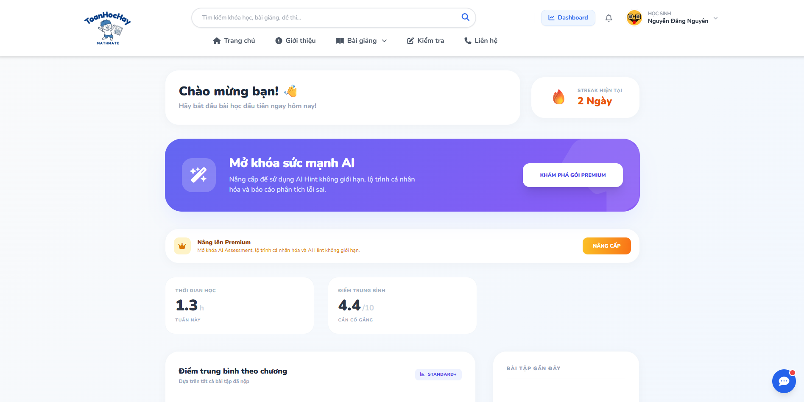

### 7. Parent linking & monitoring
Parents invite / connect to their child via a link code, see an overview of all their children, and
receive rule-based notifications (tab switching during a test, low scores, 3 days of inactivity).

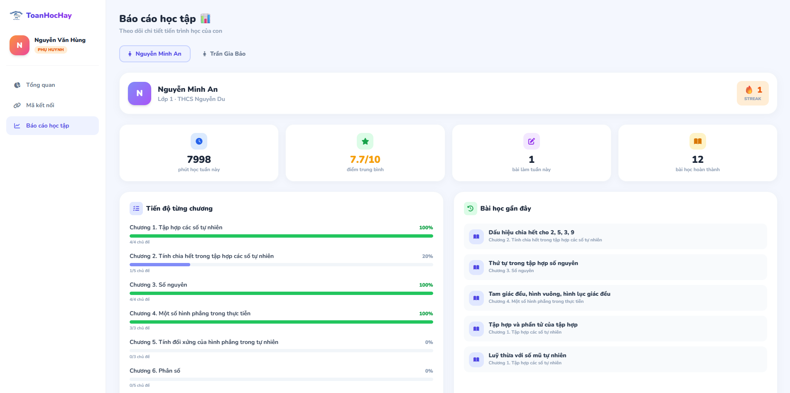

### 8. Payments & subscriptions
**Free / Standard / Premium** packages. Payment via **SePay** (bank-transfer QR + idempotent IPN
webhook). The checkout page counts down to the QR deadline (server clock). A background sweep manages
the subscription lifecycle (expiry / renewal); there is a semi-automated **refund** flow.

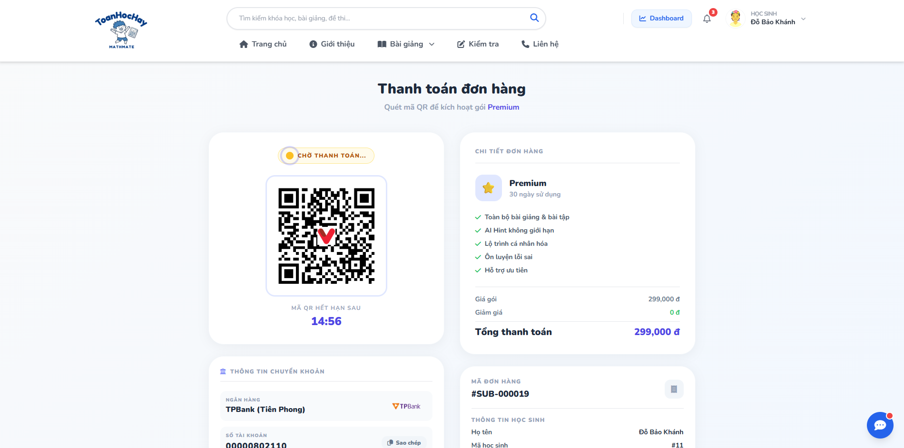

### 9. Notifications
An in-app notification bell plus email; students and parents can turn off each notification type.

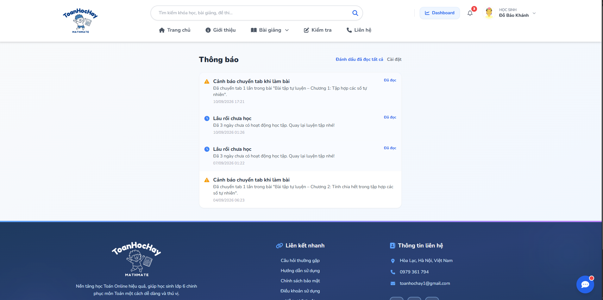

### 10. Content authoring & import (ContentEditor / AcademicReviewer)
Course-version workflow: **Draft → submit for review → review → publish**. Question bank + question
review + exercise publishing. Supports **bulk import from CSV/XLSX** (curriculum, question bank,
exercises) — with a "validate only" mode before writing.

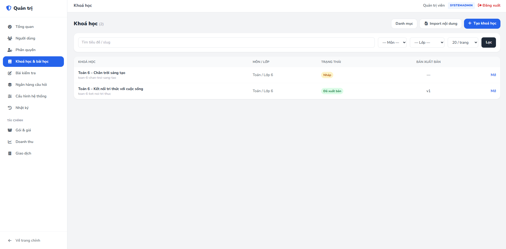

### 11. System administration (SystemAdmin) & Finance area (FinanceManager)
User / role management, audit log, system configuration. Finance area: package & pricing management,
**revenue charts** (line over time, doughnut by package, bar by payment method), and a transaction list.

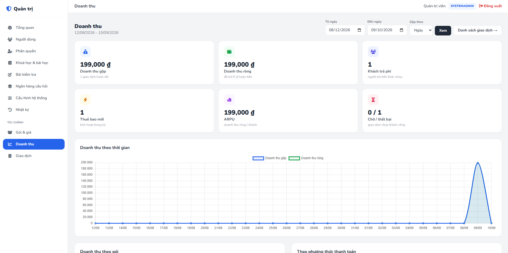

---

## Features

- JWT sign-up / sign-in, rotating refresh token, email confirmation, forgot password, login lockout.
- 7 roles: `Student`, `Parent`, `ContentEditor`, `AcademicReviewer`, `SupportStaff`,
  `FinanceManager`, `SystemAdmin`.
- 3-tier content access control (Free / Standard / Premium) plus subscription-based entitlements.
- Autosaving attempts, resume in-progress work, automatic grading, timed tests, tab-switch tracking.
- Level-based AI hints (quota-limited), post-submission AI feedback (background queue), advisory chatbot.
- Student dashboard: progress by chapter, weak topics, streak, heatmap, results chart.
- Parent–student linking, multi-child overview, rule-based notifications.
- SePay payments (QR + idempotent IPN), subscription lifecycle, semi-automated refunds.
- In-app + email notifications, per-type opt-out.
- Content authoring with a review workflow, bulk content import from CSV/XLSX.
- Admin area: users, roles, audit log, dynamic configuration; finance area with revenue charts.
- Operational foundation: Serilog + correlation-id, global exception handler, health checks
  (`/health`, `/health/ready`), per-user partitioned rate limiting, pagination, Swagger.

---

## Architecture & tech stack

The system has **3 components** that run independently and talk over HTTP:

```
┌──────────────────────┐        REST/JSON        ┌──────────────────────┐
│  ToanHocHay.WebApp    │ ─────────────────────▶ │  ELearning_ToanHocHay │
│  ASP.NET Core MVC 9   │  (Bearer + refresh)    │  ASP.NET Core API 9   │
│  (repo _Web)          │ ◀───────────────────── │                       │
└──────────────────────┘                        └───────┬───────┬──────┘
        ▲ cookie auth                                   │       │
        │ browser                          EF Core 8    │       │ X-Internal-Api-Key
        │                                                ▼       ▼
   👩‍🎓 Student / 👪 Parent / 🛠️ Admin           PostgreSQL 16   ai_core (Flask + Gemini)
```

### Backend API — `ELearning_ToanHocHay` (this repo)

| Technology | Role in the project |
|---|---|
| **ASP.NET Core 9 (Web API)** | REST API for all business logic; kebab-plural routes, a uniform `ApiResponse` envelope. |
| **Entity Framework Core 8 + Npgsql** | ORM, queries, and migrations for PostgreSQL. |
| **PostgreSQL 16** | Relational database (users, content, attempts, payments, progress…). |
| **JWT Bearer + refresh token** | Authentication; short-lived access token, rotating refresh token with reuse detection, `SecurityStamp` for token revocation. |
| **BCrypt.Net-Next** | Password hashing. |
| **AutoMapper** | Entity ↔ DTO mapping. |
| **Serilog** | Structured logging + correlation-id middleware; global exception handler (no error details leaked). |
| **Swashbuckle / Swagger** | Interactive API docs (`/swagger`), grouped per controller. |
| **SendGrid** | Transactional email: account confirmation, password reset, notifications. |
| **ASP.NET RateLimiter** | Rate limits for `auth` / `ai` / `refund`, partitioned by `X-Client-Key` (real IP behind a proxy). |
| **Data Protection (EF store)** | Persists shared encryption keys across multiple instances. |
| **Hosted Services** | Subscription-lifecycle sweep; background email queue; background AI-feedback queue. |

### AI service — `AI/` (Flask microservice, container `ai_core`)

| Technology | Role |
|---|---|
| **Python 3.12 + Flask + Gunicorn** | Internal microservice, accepts requests only from the API via the secret `X-Internal-Api-Key` header. |
| **Google Gemini** (`google-generativeai`) | Generates hints, exercise feedback, and chatbot replies; supports rotating multiple API keys. |
| **Pillow** | Processes question images sent with the prompt. |

Endpoints: `/api/hint`, `/api/feedback`, `/api/ai-insights`, `/api/chatbot/*`, `/api/health`.

### Frontend — `ToanHocHay.WebApp` ([separate repo](https://github.com/NguyenDag/ELearning_ToanHocHay_Web))

| Technology | Role |
|---|---|
| **ASP.NET Core MVC 9** | Server-rendered UI (Razor Views + Areas for the admin area). |
| **Cookie authentication + session token store** | Browser sign-in; API tokens kept in the session. |
| **HttpClient + DelegatingHandler** | Automatically attaches the Bearer token and **auto-refreshes** on 401 / near expiry. |
| **Tailwind CSS, Chart.js 4** | UI; revenue charts in the finance area. |

### DevOps

- **Docker + Docker Compose** — `postgres` + `api` + `ai_core`.
- **GitHub Actions → Azure Web App** — automatic build & deploy on push to `main` (separate workflows for API and WebApp).

---

## Getting started

### Prerequisites

| Required | Notes |
|---|---|
| **.NET 9 SDK** | Builds both the API and the WebApp. |
| **PostgreSQL 16** | Or use the container in `docker-compose.yml`. |
| **Docker Desktop** | *Recommended* — spins up the whole stack quickly; also needed for integration tests. |
| **Python 3.12** | Only if you run the AI service outside Docker. |
| **Google Gemini API key** | For the hint / feedback / chatbot features — get one at <https://aistudio.google.com/apikey>. |
| SendGrid API key | *Optional* — without it, email can't be sent (accounts are still created). |
| SePay account | *Optional* — for the real payment flow. |

### Option A — Docker Compose (fastest)

```bash
git clone https://github.com/NguyenDag/ELearning_ToanHocHay.git
cd ELearning_ToanHocHay

# 1. Create config files from the templates and fill in real values
cp .env.example .env
cp AI/.env.example AI/.env
#   - .env       : JwtSettings__SecretKey (>=32 chars), AI__InternalApiKey, SePay__*, SendGrid__*
#   - AI/.env    : GEMINI_API_KEY, INTERNAL_API_KEY (must match AI__InternalApiKey in .env)

# 2. Run the whole stack: PostgreSQL + API + AI service
docker compose up -d --build

# API       : http://localhost        (Swagger: http://localhost/swagger)
# AI (debug): http://localhost:5001/api/health
# Postgres  : localhost:5432
```

Migrations run automatically on API startup (`db.Database.Migrate()`), then the seeders create an
admin account and the 3 default packages (see [Configuration](#configuration)).

### Option B — Run manually (dev)

```bash
# 0. PostgreSQL: use the ready-made container for convenience
docker compose up -d postgres

# 1. Backend API
cd ELearning_ToanHocHay
dotnet user-secrets set "JwtSettings:SecretKey" "<random string >= 32 chars>"
cp appsettings.Example.json appsettings.json     # edit ConnectionStrings, DefaultAdmin, AI...
dotnet ef database update                        # if you want to run the migration manually
dotnet run                                       # https://localhost:7290 — /swagger

# 2. AI service (a separate terminal)
cd AI
python -m venv .venv && . .venv/Scripts/activate   # Windows: .venv\Scripts\activate
pip install -r requirements.txt
cp .env.example .env                              # fill in GEMINI_API_KEY
python Main_AI_Service.py                         # http://localhost:5001

# 3. Frontend WebApp (repo ELearning_ToanHocHay_Web)
cd ../../ELearning_ToanHocHay_Web
cp appsettings.Example.json appsettings.json      # set Api:BaseUrl = the API URL from step 1
dotnet run
```

---

## Configuration

Every config key has an **equivalent environment variable** (use `__` for nesting). See the full list
in `.env.example`, `AI/.env.example`, and `appsettings.Example.json`.

### Backend API — key settings

| Key | Environment variable | Meaning |
|---|---|---|
| `ConnectionStrings:MyCnn` | `ConnectionStrings__MyCnn` | PostgreSQL connection string. |
| `JwtSettings:SecretKey` | `JwtSettings__SecretKey` | **Required, ≥ 32 chars.** Must not be in `appsettings.json` (the app throws). Use user-secrets locally, an env var on the server. |
| `AI:PythonServerUrl` | `AI__PythonServerUrl` | Flask service URL (`http://ai_core:5001` in Docker). |
| `AI:InternalApiKey` | `AI__InternalApiKey` | Shared secret with Flask (`INTERNAL_API_KEY`). |
| `DefaultAdmin:Email` / `:Password` | `DefaultAdmin__Email` / `__Password` | Creates a `SystemAdmin` account on startup if none exists. Empty = don't create. |
| `Cors:AllowedOrigins:0..n` | `Cors__AllowedOrigins__0` | WebApp origins allowed to call the API. |
| `SendGrid:ApiKey` / `SenderEmail` | `SendGrid__ApiKey` / `__SenderEmail` | Sends transactional email. |
| `SePay:BaseUrl` / `BankName` / `VA` / `ApiKeyValidator` | `SePay__*` | QR payment gateway. `BaseUrl` must be `https://qr.sepay.vn`; `ApiKeyValidator` is the shared secret matching the webhook (enter it without the `Apikey ` prefix). |
| `APP_BASE_URL` | `APP_BASE_URL` | Public WebApp URL — so links in email (confirmation, password reset) point to the right place. |

### AI service — `AI/.env`

| Variable | Meaning |
|---|---|
| `GEMINI_API_KEY` (or `GEMINI_API_KEY_1..N`) | Google Gemini API key(s); multiple keys rotate when quota is exhausted. |
| `GEMINI_MODEL` | Defaults to `gemini-3.6-flash`. |
| `INTERNAL_API_KEY` | Must match the backend's `AI__InternalApiKey`. Empty in dev = skip the check. |
| `FLASK_PORT` | Defaults to `5001`. |

### Frontend WebApp

| Key | Meaning | Default |
|---|---|---|
| `Api:BaseUrl` | Backend API root URL (without `/api`). | `http://103.98.152.182` |
| `Api:WebBaseUrl` | Public WebApp URL. | `https://www.toanhochay.com` |
| `Session:IdleTimeoutMinutes` / `Auth:CookieExpireDays` | Session lifetime / sign-in cookie lifetime. | `60` / `7` |

> The WebApp **does not use `.env`** — it holds no secrets; setting real environment variables is
> enough to override `appsettings.json`.

---

## Seed accounts & sample data

- **Admin account**: `DefaultAdminSeeder` creates a `SystemAdmin` from `DefaultAdmin__Email` /
  `DefaultAdmin__Password` on every startup (idempotent — never resets the password if it exists).
- **Default packages**: `DefaultPackageSeeder` creates 3 packages — **Free (0đ)** /
  **Standard (199,000đ / 30 days)** / **Premium (299,000đ / 30 days)**; both paid tiers unlock all
  published content.
- **Grade 6 content import**: CSV/XLSX for all three textbook series ships in `docs/content-import/` —
  load it via `POST /api/content/import` or the *Admin area → Courses & lessons → Import content* screen.

---

## Testing

The .NET test suite (`ELearning_ToanHocHay.Tests`, run locally) has **unit** and **integration** tiers:

```bash
# Unit — no Docker needed
dotnet test --filter "Level=Unit"

# Integration — needs Docker (Testcontainers spins up a throwaway PostgreSQL)
dotnet test --filter "Level=Integration"
```

The detailed test plan and catalogs (12 business flows F1–F12, an authorization matrix, unit /
integration / system tiers) live in `docs/`:
`KE-HOACH-KIEM-THU-HE-THONG.md`, `DANH-MUC-UNIT-TEST.md`, `DANH-MUC-INTEGRATION-TEST.md`,
`DANH-MUC-SYSTEM-TEST.md`.

---

## Deployment

- **CI/CD**: every push to `main` triggers GitHub Actions to build in `Release` and deploy to
  **Azure Web App** (separate workflows for API and WebApp in `.github/workflows/`).
- **Docker**: `docker compose up -d --build` brings up the whole stack; `ai_core` only exposes an
  internal port (`expose: 5001`) and is not published externally.
- For production deployments, remember to set: `JwtSettings__SecretKey`, `DefaultAdmin__*`,
  `Cors__AllowedOrigins__*`, `AI__InternalApiKey`, `RateLimiting:TrustedProxies` = the WebApp's IP,
  and `APP_BASE_URL` = the WebApp origin.

---

## Project layout

```
ELearning_ToanHocHay/                # Backend API (this repo)
├── Controllers/                     # REST endpoints (Auth, Catalog, Learn, ExerciseAttempts, Finance, Sepay…)
├── Services/                        # Interfaces + Implementations (business logic)
├── Data/
│   ├── Entities/                    # EF Core models
│   └── Seed/                        # DefaultAdminSeeder, DefaultPackageSeeder
├── Models/DTOs/                     # Request/response DTOs
├── Migrations/                      # EF Core migrations
├── Attributes/ · Common/ · Repositories/
├── AI/                              # Flask + Gemini service (container ai_core)
│   ├── Main_AI_Service.py · Logic_chatbot.py · Prompts.py
│   └── AI_model/Gemini_api.py
├── docs/                            # API review plan, test plans, curriculum, CSV import
│   ├── screenshots/                 # 📷 flow screenshots (added later)
│   └── content-import/              # Grade 6 CSV/XLSX (3 textbook series)
├── tools/CurriculumImportBuilder/   # Console app that generates the curriculum import files
├── docker-compose.yml · Dockerfile · .env.example
└── ELearning_ToanHocHay_Control.sln

ELearning_ToanHocHay_Web/            # Frontend MVC (separate repo)
├── Controllers/ · Views/            # User-facing pages (Account, Course, Lesson, Exam, Payment, Parent…)
├── Areas/Admin/                     # Admin area + finance area
└── Services/Http/                   # ApiClient, AuthTokenHandler (auto refresh), ApiRoutes
```

---

## Team

An **EXE (Entrepreneurship Experience) course project — FPT University**, built by a team of 6
(Nguyen · Dat · Duc · Giang · Hanh · Quan).

Code contributors:

| Member | Role | GitHub |
|---|---|---|
| Dang Nguyen | Team lead · Backend API · Frontend · DevOps | [@NguyenDag](https://github.com/NguyenDag) |
| Duc | Frontend · WebApp | [@ducnt14112004](https://github.com/ducnt14112004) |
| Dat | Backend · AI service | [@Datnthe11](https://github.com/Datnthe11) |

---

## License

Proposed under the **MIT License**. Add a [`LICENSE`](LICENSE) file to the repo root and update this
section to match.

> The project currently has no `LICENSE` file. If this is coursework / an internal product not yet
> meant to be open-sourced, replace the line above with
> *"All rights reserved — EXE course project, FPT University"*.
