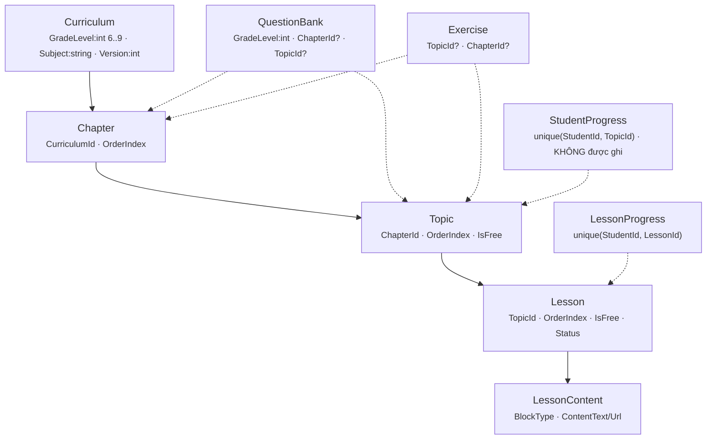

# Khung chương trình — thiết kế lại

> **ToanHocHay · Kiến trúc dữ liệu · Đề xuất**

Tái cấu trúc phần lõi CSDL — *Curriculum → Chapter → Topic → Lesson* — để nền tảng mở rộng từ Toán lớp 6 sang lớp 7·8·9 và sang nhiều môn học, hỗ trợ nhiều bộ sách giáo khoa, đồng thời theo dõi được tiến độ học sinh và cho phụ huynh giám sát việc học của con.

| | |
|---|---|
| **Phiên bản** | Đề xuất v3 |
| **Ngày** | 30·08·2026 |
| **Phạm vi** | Khung chương trình · Thanh toán · Phụ huynh · Tiến độ · 7 vai trò |
| **Trạng thái DB** | Chưa có dữ liệu thật |

## Mục lục

1. [Tóm tắt & quyết định](#0-tóm-tắt--quyết-định)
2. [Hiện trạng](#1-hiện-trạng)
3. [Vì sao chưa scale được](#2-vì-sao-chưa-scale-được)
4. [Nguyên tắc: mô hình phân tầng](#3-nguyên-tắc-mô-hình-phân-tầng)
5. [Sơ đồ quan hệ đề xuất](#4-sơ-đồ-quan-hệ-đề-xuất)
6. [Chi tiết từng tầng](#5-chi-tiết-từng-tầng)
7. [Rà soát: thanh toán · phụ huynh · tiến độ](#6-rà-soát-thanh-toán--phụ-huynh--tiến-độ)
8. [Bao phủ chức năng theo vai trò](#7-bao-phủ-chức-năng-theo-vai-trò)
9. [Ánh xạ cũ → mới](#8-ánh-xạ-cũ--mới)
10. [Phác thảo entity C#](#9-phác-thảo-entity-c)
11. [Lộ trình triển khai](#10-lộ-trình-triển-khai)
12. [Rủi ro & câu hỏi mở](#11-rủi-ro--câu-hỏi-mở)
13. [Phụ lục vận hành](#12-phụ-lục-vận-hành)

---

## §0 Tóm tắt & quyết định

> **Vấn đề cốt lõi:** `Curriculum` hiện gánh cùng lúc hai vai — vừa là *định nghĩa syllabus*, vừa là *thứ học sinh ghi danh để học* — trong khi `Subject` chỉ là chuỗi text và `GradeLevel` bị đóng cứng `int [6..9]`. Cấu trúc này gắn chặt với bối cảnh "một môn, bốn lớp" và đã lộ nợ kỹ thuật (xem §2, §6).
>
> **Đề xuất:** tách thành 4 tầng — *Danh mục → Khoá học → Cây nội dung → Kỹ năng* — cộng ba tầng cắt ngang cho *tiến độ*, *phân quyền theo gói* và *liên kết phụ huynh*.
>
> **Bối cảnh thuận lợi:** DB chưa có dữ liệu thật ⇒ không cần migration bảo toàn dữ liệu. Viết lại entity, xoá DB, tạo một migration `InitialCreate` mới. "Lộ trình" ở §10 là thứ tự *triển khai*, không phải thứ tự di trú.

### Quyết định vòng 1

| Chủ đề | Quyết định | Ảnh hưởng thiết kế |
|---|---|---|
| Dữ liệu hiện có | Chưa launch, không có data quan trọng | Viết lại entity + 1 migration mới, được phép reset DB |
| Bộ sách giáo khoa | Cần hỗ trợ nhiều bộ SGK | Giữ `CurriculumFramework`; `Course` unique theo (Môn × Lớp × Bộ sách) |
| Học thích ứng theo kỹ năng | Có nhưng chưa gấp | Dựng sẵn bảng `Skill` + bảng nối, chưa bắt buộc dữ liệu — Giai đoạn 2 |

### Quyết định vòng 2

| Chủ đề | Quyết định | Ảnh hưởng thiết kế |
|---|---|---|
| Cấu trúc cây nội dung | Dùng cây tự tham chiếu `ContentNode` | Chốt §5.3 phương án A; phương án B chỉ còn là ghi chú lịch sử |
| Phiên bản nội dung | Giữ bản published cũ khi soạn bản mới | Thêm `CourseVersion` + `NodeRevision` (§5.9), bỏ `Version : int` |
| Phạm vi ngân hàng câu hỏi | `QuestionBank` theo Subject + Grade, gắn Course tuỳ chọn | `SubjectId` + `GradeLevelId` bắt buộc, `CourseId?` nullable (§5.5) |
| Đa ngôn ngữ | Chưa xử lý | Không thêm bảng dịch; ghi nhận ở §11 là ngoài phạm vi |

### Quyết định vòng 3

| Chủ đề | Quyết định | Ảnh hưởng thiết kế |
|---|---|---|
| Mua khoá học | Học sinh mua 1 hoặc nhiều khoá | `Order` + `OrderItem` + `Course.ListPrice`; `StudentCourse.Source = Purchase` (§5.10) |
| Vai trò | Mỗi người 1 vai, admin đổi được | Giữ `UserType` enum; đổi vai ghi `AuditLog` (§5.13); **không** làm `UserRole` M:N |
| Hỗ trợ | Chat realtime + AI; không xong → điện thoại | `ChatConversation` + `ChatMessage` (SenderType User/AI/Staff), SignalR; `SupportTicket` giữ cho việc có hồ sơ (§5.12) |
| Duyệt nội dung | Reviewer duyệt cả `CourseVersion` | Node bỏ workflow riêng; `ContentReview` + `ReviewComment` gắn `CourseVersionId`; `CourseVersion.State` Draft→InReview→Approved→Published (§5.9) |
| Nội dung bài học | Lý thuyết + video/animation + tài liệu tải về + flashcard | `ContentBlock` (+Animation/Embed), `LessonResource` (IsDownloadable), `FlashcardDeck`/`Flashcard`, `MediaAsset` (§5.3) |
| Học khi chưa đăng nhập | Khách xem bài cơ bản + làm bài tập trong hạn mức (admin cấu hình); đếm cả session & IP; tiến độ chỉ cho tài khoản | 3 bậc truy cập (§5.7) + `GuestSession` + `GuestIpUsage` + nới `ExerciseAttempt.StudentId` nullable; `NodeProgress` giữ NOT NULL (§5.14) |
| Khuyến mãi | Mua lần đầu, dịp đặc biệt, mã KOL, cap lượt dùng | `Promotion` + `PromotionScope` + `PromotionRedemption` + `PromotionEngine` lúc checkout; discount phân bổ xuống `OrderItem` (§5.15) |

> **⚠️ Ba lỗ hổng đã phát hiện khi rà soát code hiện tại** (chi tiết §6):
>
> 1. Bảng `StudentProgress` (mastery theo topic) **không được ghi ở bất kỳ đâu**, nhưng dashboard lại đọc nó ⇒ thống kê "đã hoàn thành / điểm yếu" đang lệch.
> 2. `DashboardRepository` hard-code `targetCurriculumId = 3` ⇒ tiến độ chương chỉ đúng cho một curriculum.
> 3. Thanh toán chỉ gắn `StudentId`, `Subscription` giả định mỗi học sinh một gói active ⇒ phụ huynh không đứng tên trả được, không mua song song nhiều môn được.

---

## §1 Hiện trạng

Nhóm entity khung chương trình đang tổ chức thành một cây cố định bốn tầng, cộng ngân hàng câu hỏi và bài tập treo song song vào cây bằng khoá ngoại nullable kép.



*Hình 1 — Khung chương trình hiện tại. Nét đứt = khoá ngoại nullable (ClientSetNull).*

---

## §2 Vì sao chưa scale được

| # | Điểm nghẽn | Hệ quả khi mở rộng đa lớp / đa môn |
|---|---|---|
| 1 | `Subject` là chuỗi tự do trên `Curriculum`, không có bảng `Subject` | "Toán" / "Toan" / "Math" phân mảnh; không gắn được icon, mô tả, slug, thứ tự hiển thị; mọi truy vấn "toàn bộ môn Toán" phải so khớp chuỗi |
| 2 | `GradeLevel` là `int` đóng cứng `[Range(6,9)]` ở `Curriculum`, `QuestionBank`, `Student` | Thêm lớp 10–12 hoặc khoá phi lớp buộc sửa annotation + migration khắp nơi; mô hình vỡ khái niệm |
| 3 | `Curriculum` gánh hai vai: định nghĩa syllabus *và* đơn vị học sinh ghi danh | Không có "catalog" để duyệt/ghi danh; không tách được bản nháp v2 với bản v1 đang phát hành |
| 4 | Không có khái niệm bộ sách / khung chuẩn | Việt Nam có 3 bộ SGK được duyệt, mỗi bộ một thứ tự chương khác nhau — model hiện tại không biểu diễn được |
| 5 | Cây cố định 4 tầng Curriculum → Chapter → Topic → Lesson | Môn khác tổ chức khác (Ngữ văn: một "Bài" gồm nhiều văn bản; nhiều môn muốn Chương → Bài, bỏ Topic) |
| 6 | `QuestionBank` / `Exercise` trỏ `ChapterId?` + `TopicId?` nullable kép + `ClientSetNull` | Code smell; liên kết nội dung nên đi qua một khoá node ổn định duy nhất |
| 7 | `StudentProgress` chỉ khoá theo `TopicId` — và thực tế **không có code nào ghi vào bảng này** | Không roll-up theo chương / khoá / môn; mastery / điểm yếu / roadmap AI đang tính rỗng hoặc lệch |
| 8 | Không có taxonomy kỹ năng; `Tag` chỉ gắn ở câu hỏi, free-text, không phân cấp | AI gợi ý và lộ trình cá nhân hoá không có "trục" để bám |
| 9 | `IsFree` rải rác ở Topic / Lesson / Exercise; `Package` không liên kết với nội dung nào | Nhiều môn / nhiều gói ⇒ không xác định được gói nào mở khoá nội dung nào |
| 10 | `Payment.StudentId` là chủ thể duy nhất; `Subscription` giả định mỗi học sinh một gói active | Phụ huynh không đứng tên thanh toán; không mua song song "Toán Premium" + "Khoa học Standard" |
| 11 | Dashboard hard-code `targetCurriculumId = 3`; thống kê gộp toàn bộ, không tách theo môn / khoá | Không hiển thị được tiến độ riêng từng khoá học khi có nhiều môn |

---

## §3 Nguyên tắc: mô hình phân tầng

Tách trách nhiệm thành các tầng có nhịp thay đổi khác nhau. Tầng trên cùng gần như tĩnh; càng xuống dưới càng biến động theo nội dung và theo người học.

| Tầng | Entity | Mô tả |
|---|---|---|
| **Tầng 1 — Danh mục** | `Subject · GradeLevel · CurriculumFramework` | Bảng tra cứu. Thay toàn bộ `string Subject` và `int GradeLevel`. Nơi neo metadata: icon, màu, slug, thứ tự, bộ sách. |
| **Tầng 2 — Khoá học** | `Course · CourseVersion` | Đơn vị học sinh ghi danh và duyệt trong catalog. Unique theo (Môn × Lớp × Bộ sách). `CourseVersion` giữ bản đã phát hành khi soạn bản kế tiếp. |
| **Tầng 3 — Cây nội dung** | `ContentNode · LessonDetail · ContentBlock · NodeRevision` | Cây tự tham chiếu. Chương, chủ đề, bài học đều là node — độ sâu do dữ liệu quyết định. Xoá được hack nullable kép. |
| **Tầng 4 — Kỹ năng** | `Skill · NodeSkill · QuestionSkill` | Cây kỹ năng theo môn. Trục có cấu trúc để tiến độ và AI bám vào. **Giai đoạn 2** — dựng bảng trước, chưa bắt buộc dữ liệu. |
| **Cắt ngang — Tiến độ** | `StudentCourse · NodeProgress · SkillProgress` | Ghi danh nhiều khoá đồng thời. Gộp `StudentProgress` + `LessonProgress` thành một bảng tiến độ theo node, có bộ cập nhật chạy sau mỗi lần submit, roll-up mọi cấp. |
| **Cắt ngang — Phân quyền** | `PackageEntitlement` | Ánh xạ `Package` → phạm vi nội dung (toàn bộ / theo môn / theo lớp / theo khoá). Cho phép nhiều subscription active song song. |
| **Cắt ngang — Phụ huynh** | `ParentLink · ParentInvite · Notification(audience)` | Liên kết phụ huynh ↔ con có trạng thái (Pending / Active / Revoked). Phụ huynh đứng tên thanh toán, nhận thông báo về việc học của con. |

---

## §4 Sơ đồ quan hệ đề xuất

```mermaid
erDiagram
    SUBJECT              ||--o{ COURSE : ""
    GRADELEVEL           ||--o{ COURSE : ""
    CURRICULUM_FRAMEWORK ||--o{ COURSE : ""
    COURSE               ||--o{ COURSE_VERSION : ""
    COURSE               ||--o{ CONTENT_NODE : contains
    CONTENT_NODE         ||--o{ CONTENT_NODE : parent-child
    CONTENT_NODE         ||--o| LESSON_DETAIL : ""
    CONTENT_NODE         ||--o{ CONTENT_BLOCK : ""
    CONTENT_NODE         ||--o{ NODE_REVISION : ""
    SUBJECT              ||--o{ SKILL : ""
    SKILL                ||--o{ SKILL : parent-child
    CONTENT_NODE         }o--o{ SKILL : NODE_SKILL
    QUESTION             }o--o{ SKILL : QUESTION_SKILL
    QUESTION             }o--o{ CONTENT_NODE : QUESTION_NODE
    SUBJECT              ||--o{ QUESTION_BANK : ""
    GRADELEVEL           ||--o{ QUESTION_BANK : ""
    QUESTION_BANK        ||--o{ QUESTION : ""
    CONTENT_NODE         ||--o{ EXERCISE : ""
    STUDENT              ||--o{ STUDENT_COURSE : ""
    COURSE               ||--o{ STUDENT_COURSE : ""
    STUDENT              ||--o{ NODE_PROGRESS : ""
    CONTENT_NODE         ||--o{ NODE_PROGRESS : ""
    STUDENT              ||--o{ SKILL_PROGRESS : ""
    SKILL                ||--o{ SKILL_PROGRESS : ""
    PACKAGE              ||--o{ PACKAGE_ENTITLEMENT : ""
    COURSE               ||--o{ PACKAGE_ENTITLEMENT : scope
    STUDENT              ||--o{ SUBSCRIPTION : ""
    PACKAGE              ||--o{ SUBSCRIPTION : ""
    USER                 ||--o{ PAYMENT : pays
    STUDENT              ||--o{ PAYMENT : for
    PAYMENT              ||--o| SUBSCRIPTION : ""
    PARENT               ||--o{ PARENT_LINK : ""
    STUDENT              ||--o{ PARENT_LINK : ""
    PARENT               ||--o{ PARENT_INVITE : ""
    STUDENT              ||--o{ NOTIFICATION : about
    USER                 ||--o{ NOTIFICATION : to
```

*Hình 2 — Quan hệ mục tiêu. Bảng nối M:N in hoa dưới tên quan hệ.*

Khác biệt chính so với Hình 1: mọi liên kết nội dung hội tụ về `CONTENT_NODE` — một khoá duy nhất; `COURSE` chen vào giữa danh mục và cây; `PAYMENT` tách người trả (`USER`) khỏi người học (`STUDENT`); `PARENT_LINK` thay quan hệ `StudentParent` phẳng; `NOTIFICATION` có thể "về" một học sinh và "gửi tới" phụ huynh.

---

## §5 Chi tiết từng tầng

### 5.1 Tầng danh mục

| Bảng | Cột chính | Ghi chú |
|---|---|---|
| **[mới]** `Subject` | `SubjectId`, `Code` (unique, vd "MATH"), `Name`, `Slug`, `Description`, `IconUrl`, `ColorHex`, `DisplayOrder`, `IsActive` | Thay `Curriculum.Subject : string` |
| **[mới]** `GradeLevel` | `GradeLevelId`, `Code` ("G6"), `Name` ("Lớp 6"), `Stage` (enum: Primary / LowerSecondary / UpperSecondary / ExamPrep / Other), `DisplayOrder`, `IsActive` | Thay mọi `int GradeLevel [Range(6,9)]` |
| **[mới]** `CurriculumFramework` | `FrameworkId`, `Code` ("KNTT"), `Name` ("Kết nối tri thức"), `Publisher`, `IsActive` | Bộ sách giáo khoa / khung chuẩn |

### 5.2 Tầng khoá học

**[mới]** `Course` — `CourseId`, `SubjectId`, `GradeLevelId`, `FrameworkId?`, `Title`, `Slug` (unique), `Description`, `ThumbnailUrl`, `Status` (Draft / Published / Archived), `DisplayOrder`, `CreatedBy`, timestamps.

- Unique index `(SubjectId, GradeLevelId, FrameworkId)` — "Toán 6 – KNTT" là đúng một Course.
- Thay vai "đơn vị học sinh học" của `Curriculum`. Phiên bản hoá nằm ở `CourseVersion` (§5.9).

### 5.3 Tầng cây nội dung *(đã chốt phương án A)*

**[mới]** `ContentNode` — `NodeId`, `CourseId`, `ParentNodeId?` (tự trỏ), `NodeType` (Chapter / Topic / SubTopic / Lesson…), `Title`, `Slug`, `OrderIndex`, `Depth`, `MaterializedPath` ("/1/5/12/"), `IsFree`, `Status`, `PublishedAt`.

- **[gộp]** `Chapter`, `Topic` → node phi lá. `Lesson` → node có `NodeType = Lesson`.
- **[mới]** `LessonDetail` — mở rộng 1:1 cho node kiểu Lesson: `NodeId` (PK/FK), `DurationMinutes`, `ReviewedBy`, `ReviewedAt`, `RejectReason`, workflow.
- **[đổi tên]** `LessonContent` → `ContentBlock`: `BlockId`, `NodeId`, `BlockType`, `ContentText`, `ContentUrl`, `MetadataJson`, `OrderIndex`. `BlockType` mở rộng: `Heading / Text / Definition / Example / Note / Formula / Image / Video / Animation / Embed / Audio`. Bài lý thuyết = chuỗi block; video / animation minh hoạ = block `Video` / `Animation`.
- **[mới]** `LessonResource` — tài liệu tham khảo *tải về được*, tách khỏi nội dung inline: `ResourceId`, `NodeId`, `Title`, `ResourceType` (Pdf / Slide / Doc / Sheet / ExternalLink), `MediaAssetId?`, `ExternalUrl?`, `IsDownloadable`, `OrderIndex`.
- **[mới]** `FlashcardDeck` (`DeckId`, `NodeId`, `Title`) + `Flashcard` (`CardId`, `DeckId`, `FrontText`, `BackText`, `FrontImageUrl?`, `BackImageUrl?`, `Hint?`, `OrderIndex`). Flashcard là dữ liệu có cấu trúc, không nhét vào một `ContentBlock` text được. Về sau nối vào SRS / `SkillProgress`.
- **[mới]** `MediaAsset` — thư viện file dùng chung: `MediaAssetId`, `StorageKey`, `Url`, `MimeType`, `SizeBytes`, `OriginalFileName`, `UploadedBy`, `UploadedAt`. Mọi `ContentUrl` / `FileUrl` nên trỏ qua đây thay vì string rời — để tái sử dụng, đếm tham chiếu, dọn file mồ côi.
- `MaterializedPath` + `Depth` cho phép truy vấn cả cây con bằng `LIKE '/1/5/%'` — không đệ quy.
- **[mới]** `ContentNode` thêm `CreatedBy`, `UpdatedBy`, `UpdatedAt` — cần cho quy trình biên tập & nhật ký.

> **Ràng buộc cây (đã chốt — lai).** DB ép các bất biến rẻ: `Depth ≥ 0`, định dạng `MaterializedPath`, và **node cùng `CourseVersionId` với cha**. Luật lồng nhau (cái gì chứa cái gì) ở `ContentTreeService`, dựa bảng dữ liệu **[mới]** `NodeTypeRule` (`SubjectId?`, `ParentType?`, `ChildType`) — chỉnh theo môn, không cần migration. Seed 6 dòng cho Toán (§11). `SystemConfig.content.maxTreeDepth = 4`. Service là con đường duy nhất cho cả editor lẫn import; job đêm quét toàn vẹn. Phương án B (Chapter/Topic/Lesson tách bảng) đã loại ở vòng 2.

### 5.4 Tầng kỹ năng *(Giai đoạn 2)*

- **[mới]** `Skill` — `SkillId`, `SubjectId`, `ParentSkillId?`, `Code`, `Name`, `Description`. Cây kỹ năng theo môn.
- **[mới]** `NodeSkill` (M:N) — bài học dạy những kỹ năng nào.
- **[mới]** `QuestionSkill` (M:N + `Weight`) — thay phần `Tag` kiểu Skill / Knowledge.
- Giữ `Tag` cho gắn nhãn biên tập tự do; `Skill` là taxonomy có cấu trúc mà tiến độ & adaptivity phụ thuộc.

### 5.5 Ngân hàng câu hỏi & bài tập *(đã chốt phạm vi)*

- **[sửa]** `QuestionBank`: bỏ `GradeLevel : int`; `SubjectId` + `GradeLevelId` **bắt buộc**; `CourseId?` **tuỳ chọn** (để gắn ngân hàng vào một khoá cụ thể khi cần); `PrimaryNodeId?` thay cho `ChapterId?`/`TopicId?`.
- Đặt theo Subject + Grade ⇒ một ngân hàng dùng chung cho cả 3 bộ SGK cùng lớp; gắn Course chỉ khi ngân hàng riêng cho khoá đó.
- **[sửa]** `Question`: thêm `SubjectId` (denormalize để lọc). Map vào cây qua **[mới]** `QuestionNode` (M:N) — một câu hỏi tái sử dụng ở nhiều node / course.
- **[sửa]** `Exercise`: một FK `NodeId` thay `TopicId?`/`ChapterId?` → **xoá hack `ClientSetNull`**.

### 5.6 Tiến độ học

- **[mới]** `StudentCourse` — `StudentId`×`CourseId`, `EnrolledAt`, `Source` (Self / Assigned / Subscription), `Status`, `ProgressPercent` (cache). Học sinh học đồng thời Toán 6 + Toán 7 + Khoa học 6.
- **[gộp]** `NodeProgress` thay `StudentProgress` + `LessonProgress` — `StudentId`, `NodeId`, `Status`, `MasteryLevel`, `CompletionPercent`, `TimeSpentSeconds`, `TotalAttempts`, `CorrectCount`, `WrongCount`, `LastAccessedAt`. Unique `(StudentId, NodeId)`; dùng chung cho chương / topic / lesson.
- **Bắt buộc:** một bộ cập nhật (domain event / service) chạy sau mỗi lần `ExerciseAttempt` được submit và mỗi lần lesson hoàn thành — cập nhật `NodeProgress` của node lá rồi roll-up ngược lên theo `MaterializedPath`. Đây là thứ đang thiếu hoàn toàn ở code hiện tại (§6.3).
- **[mới]** `SkillProgress` — `StudentId`, `SkillId`, `MasteryScore` (0–1), `LastAssessedAt`. Giai đoạn 2.

### 5.7 Phân quyền nội dung theo gói

- **[mới]** `PackageEntitlement` — `PackageId`, `ScopeType` (AllContent / Subject / Grade / SubjectGrade / Course), `SubjectId?`, `GradeLevelId?`, `CourseId?`.
- Cho phép **nhiều `Subscription` ở trạng thái `Active` cùng lúc**.
- Một service `IContentAccessService` tập trung, trả quyền theo **3 bậc**:

| Bậc | Được gì | Cơ chế |
|---|---|---|
| **Ẩn danh** (chưa đăng nhập) | Node & Exercise có `IsFree = true`, trong hạn mức guest | Không có user ⇒ service chỉ trả nội dung `IsFree`; đếm lượt qua `GuestSession` (§5.14) |
| **Đã đăng ký, chưa mua** | Như ẩn danh + lưu tiến độ, hồ sơ, đồng bộ nhiều thiết bị | Có `Student`, chưa có `Subscription`/`StudentCourse` ⇒ vẫn chỉ `IsFree` |
| **Đã mua** (gói hoặc khoá lẻ) | Nội dung theo entitlement + đầy đủ dạng bài tập / dạng thi | `IsFree` ∪ `PackageEntitlement` của subscription active ∪ `StudentCourse` (mua / gán) |

**[mới]** `Exercise` thêm `RequiredTier` (Free / Standard / Premium) hoặc dựa thẳng vào `IsFree` + entitlement của `NodeId` chứa nó. "Dạng thi nhiều loại hơn" = tác giả tạo thêm `Exercise` kiểu `Test`/`Exam` với `IsFree = false`.

### 5.8 Điều chỉnh entity Student

**[sửa]** `Student.GradeLevel : int` → `Student.CurrentGradeLevelId? : FK` (nullable). Chỉ là "lớp mặc định" cho UX; quyền truy cập thật đi qua enrollment / entitlement.

### 5.9 Phiên bản nội dung & quy trình duyệt *(mới)*

Yêu cầu: giữ bản đang phát hành chạy bình thường trong khi biên tập viên soạn bản kế tiếp; **Academic Reviewer duyệt cả một `CourseVersion` một lần**, không duyệt từng node lẻ.

- **[mới]** `CourseVersion` — `CourseVersionId`, `CourseId`, `VersionNumber`, `Label` ("Năm học 2026–2027"), `State` (`Draft → InReview → Approved → Published → Archived`; hoặc `InReview → Draft` khi bị trả lại), `SubmittedBy`/`SubmittedAt`, `PublishedAt`/`PublishedBy`. Mỗi Course có **tối đa một** version ở `Published`.
- `ContentNode.CourseVersionId` thay cho gắn trực tiếp `CourseId`. Node **không còn workflow riêng** — hiển thị hay không là do `CourseVersion.State`; publish là thao tác nguyên tử ở cấp version. (Bỏ `NodeStatus` nhiều bước, `LessonDetail` bỏ `ReviewedBy`/`ReviewedAt`.)
- Soạn bản mới = clone cây của version `Published` sang version `Draft`; submit → `InReview`; reviewer `Approve` → `Approved`; editor bấm publish → `Published`, version cũ → `Archived`.
- **[mới]** `ContentReview` — `ReviewId`, `CourseVersionId`, `ReviewerId`, `Decision` (Approve / RequestChanges / Reject), `Summary`, `CreatedAt`. Một version có thể qua nhiều vòng review.
- **[mới]** `ReviewComment` — `CommentId`, `ReviewId`, `NodeId?` / `BlockId?` (neo vào chỗ cần sửa), `Body`, `Status` (Open / Resolved), `ResolvedBy?`, `ResolvedAt?`. Đây là "đề xuất chỉnh sửa nội dung" mà vai Reviewer cần.
- **[mới]** `NodeRevision` — lịch sử chỉnh sửa từng node: `NodeId`, `RevisionNumber`, `Snapshot` (JSON), `EditedBy`, `EditedAt`. Xem diff & rollback mức node.
- `StudentCourse` ghi luôn `CourseVersionId` đã ghi danh — học sinh đang học không bị "nhảy nội dung" khi bản mới phát hành.

### 5.10 Thanh toán & mua khoá học *(sửa)*

Chốt: **học sinh mua được 1 hoặc nhiều khoá học** (bán lẻ theo khoá), song song với mô hình gói–thuê bao.

- **[sửa]** `Course`: thêm `ListPrice`, `SalePrice?`, `IsPurchasable`, `AccessDurationDays?` (null = trọn đời).
- **[mới]** `Order` — `OrderId`, `BuyerUserId` (học sinh hoặc phụ huynh), `Status` (Pending / Paid / Cancelled / Refunded), `TotalAmount`, `CreatedAt`, `PaidAt?`.
- **[mới]** `OrderItem` — `OrderItemId`, `OrderId`, `ItemType` (Course / Package), `CourseId?` / `PackageId?`, `BeneficiaryStudentId` (con nào được hưởng), `UnitPrice`, `Quantity`. Một order có thể gồm nhiều khoá cho nhiều con.
- **[sửa]** `Payment`: thêm `OrderId`, `PaidByUserId` (tách khỏi người thụ hưởng), `RefundedAt?`, `RefundAmount?`. Một `Order` → một (hoặc vài) `Payment`.
- **[sửa]** `StudentCourse.Source` += `Purchase`; thêm `AccessExpiresAt?`. Order `Paid` → sinh `StudentCourse` cho từng `OrderItem` kiểu Course.
- **[sửa]** `Package`: thêm `Tier` (Free / Standard / Premium) — thay việc so khớp chuỗi tên gói. `Subscription`: bỏ giả định "một gói active / học sinh".
- Doanh thu theo khoá (Finance) = tổng `OrderItem.UnitPrice` nhóm theo `CourseId` với `Order.Status = Paid` — truy vấn trực tiếp, không đi vòng.
- `IContentAccessService` hợp 3 nguồn: `StudentCourse` (mua / gán) ∪ `PackageEntitlement` của subscription active ∪ node `IsFree`.

### 5.11 Liên kết phụ huynh *(sửa)*

- **[đổi tên + mở rộng]** `StudentParent` → `ParentLink` — `ParentId`, `StudentId`, `Relationship`, `Status` (Pending / Active / Revoked), `IsPrimaryGuardian`, `LinkedAt`, `RevokedAt?`.
- **[mới]** `ParentInvite` — chiều ngược lại: phụ huynh mời con qua email / mã, `Token`, `ExpiresAt`, `AcceptedAt?`. Bổ sung cho `Parent.ConnectionCode` hiện có.
- **[sửa]** `Notification`: thêm `StudentId?` (thông báo "về" học sinh nào) và `Audience` (Student / Parent / Both). Một sự kiện "con làm bài < 5đ" sinh thông báo tới cả học sinh và phụ huynh `IsPrimaryGuardian`.
- **[mới]** endpoint `GET /api/parent/{id}/children/overview` — tổng hợp tiến độ tất cả các con trong một lần gọi.
- Giữ nguyên `VerifyStudentAccessAsync` — cơ chế phân quyền phụ huynh xem dashboard con đã đúng, chỉ thêm điều kiện `ParentLink.Status = Active`.

### 5.12 Hỗ trợ: chat realtime + AI *(mới)*

Chốt: chat **realtime**, có AI trả lời trước; nếu AI không giải quyết được thì hướng người dùng liên hệ qua số điện thoại. Nhân viên hỗ trợ có thể tham gia hội thoại.

- **[mới]** `ChatConversation` — `ConversationId`, `InitiatorUserId`, `StudentId?`, `Topic?`, `Status` (Bot / WaitingAgent / WithAgent / EscalatedToPhone / Closed), `AssignedStaffId?`, `CreatedAt`, `ClosedAt?`.
- **[mới]** `ChatMessage` — `MessageId`, `ConversationId`, `SenderType` (User / AI / Staff / System), `SenderUserId?`, `Body`, `SentAt`, `IsRead`, `MetadataJson?` (AI: model / confidence / nguồn trích dẫn; hoặc file đính kèm).
- AI là một "người tham gia" — tin nhắn `SenderType = AI`. Logic sinh câu trả lời (RAG trên nội dung bài giảng / FAQ) nằm ở tầng ứng dụng, DB chỉ lưu hội thoại.
- Escalate qua điện thoại = đặt `Status = EscalatedToPhone`; số điện thoại lấy từ `SystemConfig` (`support.phone`), không hard-code.
- `SupportTicket` giữ lại cho việc cần *theo dõi / xử lý có hồ sơ* (hoàn tiền, khiếu nại). Một `ChatConversation` có thể sinh `SupportTicket` — thêm `SupportTicket.ConversationId?`. Thêm `SupportMessage.IsInternalNote`.
- Giao vận realtime = SignalR / WebSocket — hạ tầng, không phải DB. Bảng chỉ cần `IsRead` + timestamp để đồng bộ.

### 5.13 Vai trò & nhật ký *(sửa)*

Chốt: mỗi người **một vai duy nhất**, admin đổi được vai.

- Giữ `User.UserType` là enum đơn trị — **không** làm `UserRole` M:N.
- Đổi vai = ghi `User.UserType` + một dòng `AuditLog` (`EntityType = "User"`, `Action = "RoleChange"`, `OldValueJson`/`NewValueJson`, `UserId` = admin thực hiện). Không cần bảng lịch sử riêng.
- **[mới bắt buộc]** `AuditLog` hiện có schema nhưng **chưa có code ghi** — thêm một `SaveChanges` interceptor (EF Core) ghi mọi thay đổi entity nhạy cảm (User, Package, Payment, Course, ContentReview…). Đây là nền cho "System Admin xem toàn bộ log".
- **[sửa]** `User`: thêm `LockedAt?`, `LockedReason?`, `LockedByUserId?`.

### 5.14 Học & làm bài khi chưa đăng nhập *(mới)*

Yêu cầu: khách vãng lai (chưa đăng nhập) vẫn **xem bài cơ bản** và **làm bài tập** trong phạm vi cho phép; đăng ký / mua gói thì mở rộng dần. Xem bài đã ổn (§5.7 — chỉ đọc node `IsFree`). Vướng là *lưu bài làm*: `ExerciseAttempt.StudentId` đang bắt buộc và FK tới `Student`.

- **[mới]** `GuestSession` — `GuestSessionId` (GUID, lưu ở cookie / localStorage), `GradeLevelId?`, `CreatedAt`, `LastSeenAt`, `LessonViewCount`, `AttemptCount`, `ConvertedToStudentId?`, `ConvertedAt?`.
- **[mới]** `GuestIpUsage` — bộ đếm theo IP theo ngày: `IpHash` + `Date` (khoá kép), `LessonViewCount`, `AttemptCount`. `IpHash = HMAC-SHA256(prefix_chuẩn_hoá + "|" + date, server_secret)` — IPv4 /32, IPv6 /64. Secret ở env var (có version), **xoay 90 ngày**, canh theo purge 60 ngày. Không lưu IP thô.
- **[sửa]** `ExerciseAttempt`: `StudentId` → nullable; thêm `GuestSessionId?`. CHECK: đúng một trong hai được set. `StudentAnswer`, `AIHint`, `AIFeedback` vẫn gắn qua `AttemptId` nên không đổi.
- **[chốt]** `NodeProgress` **chỉ ghi cho tài khoản đã đăng ký** — `StudentId` giữ nguyên NOT NULL, không có nhánh khách. Khách chỉ lưu *bài làm* (`ExerciseAttempt`), không lưu *tiến độ*.
- **Hạn mức khách** = `SystemConfig` (admin cấu hình: `guest.maxFreeLessons`, `guest.maxAttempts`, cửa sổ tính theo ngày). Kiểm **cả hai chiều**: `GuestSession.AttemptCount` *và* `GuestIpUsage.AttemptCount` của IP hôm nay — lấy ngưỡng chặt hơn. Chống lách bằng cách xoá cookie.
- **Chuyển khách → tài khoản.** Khi `GuestSession` đăng ký: tạo `Student`, `UPDATE ExerciseAttempt SET StudentId = @new, GuestSessionId = NULL WHERE GuestSessionId = @guest`, set `ConvertedToStudentId`, rồi chạy `ProgressProjectionService` một lần để **dựng `NodeProgress` từ các attempt vừa nhận**. Khách không mất kết quả.
- Dọn dữ liệu: job xoá `GuestSession` chưa convert & quá hạn (vd 90 ngày) cùng attempt của nó; `GuestIpUsage` xoá theo `Date` cũ.

> **✅ Kết luận:** thiết kế đáp ứng được. *Xem nội dung* khách chạy bằng `IsFree` + nhánh ẩn danh trong `IContentAccessService` (không đổi schema). *Làm bài tập* khách cần thêm hai bảng đếm (`GuestSession`, `GuestIpUsage`) và nới đúng một FK (`ExerciseAttempt.StudentId`). Tiến độ vẫn chỉ dành cho tài khoản đã đăng ký, dựng lại khi khách chuyển đổi. Phân tầng "mua gói thì đầy đủ hơn" đã có qua `Exercise.IsFree` + entitlement.

### 5.15 Khuyến mãi *(mới)*

Tách **chiến dịch** (`Promotion` — luật) khỏi **lượt dùng** (`PromotionRedemption` — chặn cap, hoàn tiền, báo cáo). Bộ tính giảm giá ở tầng ứng dụng.

- **[mới]** `Promotion` — `PromotionType` (AutoApplied / Code), `Code?`, `DiscountKind` (Percentage / FixedAmount / OverridePrice), `DiscountValue`, `MaxDiscountAmount?`, `StartAt?`/`EndAt?`, `Priority`, `Stackable`, `TotalUsageLimit?`, `PerUserLimit`, `MinOrderAmount?`, `FirstPurchaseOnly`, `IsActive`, `CreatedBy` (Finance).
- **[mới]** `PromotionScope` — áp cho món nào: `ScopeType` (AllItems / Subject / GradeLevel / Course / Package) + FK. Nhiều dòng = "khoá A hoặc B"; không dòng = tất cả.
- **[mới]** `PromotionRedemption` — `PromotionId`, `OrderId`, `UserId`, `Status` (Reserved / Confirmed / Released / Voided), `DiscountAmount`, `RedeemedAt`, `ConfirmedAt?`, `VoidedAt?`. Unique `(PromotionId, OrderId)`.
- **Cap tổng (`TotalUsageLimit`):** giữ chỗ lúc `Order` `Pending` qua bộ đếm nguyên tử `Promotion.ReservedCount`/`ConfirmedCount`; job nền nhả `Reserved` quá 20 phút. Promo chỉ cap/user (vd "mua lần đầu") không cần giữ chỗ.
- **[sửa]** `Order`: `SubtotalAmount` + `DiscountAmount` + `TotalAmount` (= Subtotal − Discount). `OrderItem`: `DiscountAmount` (promo phân bổ xuống dòng) → doanh thu theo khoá chính xác = `SUM(UnitPrice − DiscountAmount)`.

#### Từng kịch bản → cấu hình

| Kịch bản | Cấu hình `Promotion` |
|---|---|
| Mua lần đầu −30% | `AutoApplied`, `Percentage`, `Value=30`, `FirstPurchaseOnly=true`, `PerUserLimit=1` |
| Tết −20% (14–20/02), tối đa 100k | `AutoApplied`, `Percentage 20`, `MaxDiscountAmount=100000`, `StartAt/EndAt` đặt khoảng ngày |
| 20/11 chỉ khoá Toán 6 | như trên + `PromotionScope(Course, <Toán 6>)` |
| Mã KOL "TOANHOCHAY" −15%, 500 lượt | `Code`, `Code='TOANHOCHAY'`, `Percentage 15`, `TotalUsageLimit=500` |
| Gói năm — tháng đầu 0đ | `OverridePrice`, `Value=0` + `PromotionScope(Package, <gói năm>)` |
| Giá sốc thường trực một khoá | **Không dùng promo** — đặt `Course.SalePrice`. Promotion chỉ cho chiến dịch có thời hạn |

#### Bộ tính lúc checkout (`PromotionEngine`)

1. Lấy ứng viên: `IsActive` + trong `[StartAt, EndAt]` + (`AutoApplied` hoặc `Code` khớp mã nhập).
2. Lọc: scope khớp ≥1 món; `MinOrderAmount` đạt; `FirstPurchaseOnly` → đếm `Order` `Paid` của người mua == 0; `TotalUsageLimit`/`PerUserLimit` chưa vượt (đếm redemption chưa void).
3. Tính giảm, tôn trọng `MaxDiscountAmount`, phân bổ xuống `OrderItem` khớp scope.
4. Cộng dồn: nhiều promo `Stackable=false` → chọn cái giảm nhiều nhất / `Priority` cao nhất; `Stackable=true` cộng thêm.
5. Ghi `PromotionRedemption` + set discount trên `Order`/`OrderItem` khi `Order → Paid`.

> **Hoàn tiền:** `Order` refund → set `PromotionRedemption.VoidedAt` → cap được nhả, báo cáo đúng. **"Mua lần đầu"** tính theo tài khoản người mua (`BuyerUserId`), không theo con thụ hưởng. **Giai đoạn 3** (cùng Order / thanh toán) — vì "mua lần đầu" + "dịp đặc biệt" là cốt lõi go-to-market.

---

## §6 Rà soát: thanh toán · phụ huynh · tiến độ

Phần này trả lời trực tiếp: *với các bảng hiện tại, có theo dõi được tiến độ học sinh và cho phụ huynh giám sát việc học của con không?* Kết luận dựa trên rà soát code, không chỉ schema.

### 6.1 Thanh toán

| # | Phát hiện | Vị trí |
|---|---|---|
| 1 | `Payment.StudentId` là chủ thể duy nhất — phụ huynh không đứng tên thanh toán được | `Payment.cs` |
| 2 | `GetActivePackageAsync` trả đúng một gói ⇒ không mua song song nhiều môn | `CoreDashboardService.cs` |
| 3 | `PackageType` suy ra bằng so khớp chuỗi `"premium"` / `"standard"` trong tên gói | `CoreDashboardService.cs:165` |
| 4 | `PaymentStatus.Refunded` tồn tại nhưng không có `RefundedAt` / `RefundAmount` | `Payment.cs` |

### 6.2 Phụ huynh & liên kết con

> **✅ Điểm sáng:** `StudentParent` (M:N) + `Parent.ConnectionCode` + `VerifyStudentAccessAsync` đã cho phụ huynh gọi đúng API dashboard của con. Cơ chế nền tảng chạy được, **không cần đập đi**.

| # | Thiếu |
|---|---|
| 1 | `StudentParent` không có trạng thái — nối là vĩnh viễn, không revoke / pending / duyệt |
| 2 | Chỉ một chiều (học sinh nhập mã của phụ huynh); không có chiều phụ huynh mời con |
| 3 | Không có endpoint tổng hợp tiến độ nhiều con — `ParentController` chỉ Get / Update / Delete |
| 4 | `Notification.UserId` đơn trị — không đẩy thông báo cho phụ huynh về việc học của con |
| 5 | Phụ huynh không đứng tên thanh toán được (xem 6.1) |

### 6.3 Quản lý tiến độ học

| Bảng | Trạng thái thực tế |
|---|---|
| `ExerciseAttempt` + `StudentAnswer` | **Chắc chắn** — điểm, đúng/sai, thời gian, tab-switch đầy đủ |
| `LessonProgress` | **Một phần** — có ghi, nhưng `bool isCompleted = true;` hard-code ⇒ mọi lần update đều đánh dấu hoàn thành, không kiểm ngưỡng watch time (`LessonProgressService.cs:31`) |
| `StudentProgress` (mastery theo topic) | **Code chết** — không có nơi nào ghi vào bảng. Luồng submit (`ExerciseAttemptService.cs:201`) không đụng tới. Nhưng `DashboardRepository.cs:96` lại đọc nó với `MasteryLevel >= Intermediate` để đếm "bài đã hoàn thành" ⇒ luôn trả 0 |
| Dashboard tiến độ chương | **Hard-code** — `int targetCurriculumId = 3;` (`DashboardRepository.cs:206`) ⇒ chỉ đúng cho một curriculum |
| `LearningPath` | JSON blob, chưa dùng structured |
| Roll-up chương / khoá / môn · per-skill | **Không có** |

### 6.4 Kết luận

| Câu hỏi | Trả lời |
|---|---|
| **Theo dõi tiến độ học sinh?** | **Được ở mức cơ bản.** Dữ liệu thô (attempt, answer, lesson progress) đủ cho điểm số, streak, lịch sử, % chương tính runtime. **Nhưng**: lớp tổng hợp `StudentProgress` là code chết ⇒ "đã hoàn thành X bài", "điểm yếu", "roadmap AI" đang lệch; và mọi số liệu gộp một môn, một curriculum hard-code — mở đa môn thì phải tách theo `Course`. |
| **Phụ huynh theo dõi con?** | **Được.** `StudentParent` + `VerifyStudentAccessAsync` đã cho phụ huynh xem đúng dashboard của con — giữ nguyên. Cần bổ sung: trạng thái liên kết (revoke), endpoint tổng hợp nhiều con, thông báo đẩy cho phụ huynh, và cho phụ huynh đứng tên thanh toán. |
| **Cần làm gì tối thiểu?** | (a) Bộ cập nhật `NodeProgress` chạy sau submit + roll-up; (b) bỏ mọi ID hard-code, tách thống kê theo `Course`; (c) `ParentLink.Status` + `Notification.Audience` + `Payment.PaidByUserId`. |

---

## §7 Bao phủ chức năng theo vai trò

Đánh giá theo 7 vai trò (`UserType`: Student · Parent · ContentEditor · AcademicReviewer · SupportStaff · FinanceManager · SystemAdmin — mỗi người đúng một vai, admin đổi được). Cột trạng thái dựa trên rà soát code, không chỉ schema: **Đủ** = thiết kế phục vụ được · **Một phần** = thiếu vài cột hoặc phụ thuộc giai đoạn sau · **Thiếu** = phải dựng thêm bảng và/hoặc chưa có dòng code nào.

> **⚠️ Sáu module vận hành cần dựng thêm.** Ba trong số đó đã có bảng trong schema nhưng **không có Controller / Service / dòng code nào dùng**: `SupportTicket` + `SupportMessage` · `Notification` · `AuditLog` — cùng với ba module chưa có bảng: `ChatConversation` + `ChatMessage` (chat realtime + AI), `ContentReview` + `ReviewComment` (duyệt CourseVersion), `ContentImportJob` + `MediaAsset` (upload theo lô).

### 7.1 Học sinh (bao gồm khách chưa đăng nhập)

| Chức năng | Trạng thái | Phục vụ bởi / cần bổ sung |
|---|---|---|
| Xem giới thiệu hệ thống *(khách)* | Thiếu | Không có entity trang tĩnh. Thêm `StaticPage` (Slug, Title, BodyHtml, IsPublished) hoặc để frontend tĩnh |
| Xem bài giảng cơ bản *(khách)* | Đủ | Node `IsFree = true` + nhánh ẩn danh trong `IContentAccessService` (§5.7). Không cần đăng nhập |
| Xem bài giảng đầy đủ | Đủ | `ContentNode(Lesson)` + `ContentBlock` + `LessonResource` + `FlashcardDeck`; gate bằng `PackageEntitlement` ∪ `StudentCourse` |
| Làm bài tập cơ bản *(khách)* | Một phần | `Exercise.IsFree = true`. Cần `GuestSession` + nới `ExerciseAttempt.StudentId` nullable + `GuestSessionId?` (§5.14). Hạn mức qua `SystemConfig` |
| Làm bài tập / dạng thi đầy đủ | Đủ | `Exercise(Quiz/Test/Exam)` `IsFree = false` — mở khi có entitlement. "Nhiều loại hơn" = tác giả tạo thêm exercise không free |
| Ôn tập | Một phần | Chưa có entity riêng. Trước mắt = `Exercise(Practice)` lọc câu sai; bài bản cần `ReviewQueueItem` (SRS) — Giai đoạn 5 |
| Kiểm tra | Đủ | `Exercise(Test/Exam)` + `PlannedEndTime` + `TabSwitchLog`. Thêm `Exercise.MaxAttempts` |
| Xem kết quả bài vừa làm *(khách)* | Đủ | Từ `ExerciseAttempt`/`StudentAnswer` của `GuestSessionId` — hiển thị ngay trong phiên, không lưu tiến độ dài hạn |
| Xem kết quả, tiến độ dài hạn | Một phần | `ExerciseAttempt` + `NodeProgress` (chỉ tài khoản đã đăng ký) — chạy đúng sau khi làm §6 |
| Lộ trình cá nhân hoá | Một phần | `LearningPath` (JSON) + AI roadmap đã có; structured hoá bằng `SkillProgress` — Giai đoạn 5. Gate bằng `Package` flag `PersonalizedPath` |
| Chat với hỗ trợ | Thiếu | Đã chốt: chat realtime + AI. Cần `ChatConversation` + `ChatMessage` (SenderType User/AI/Staff/System) — §5.12. Hạ tầng SignalR/WebSocket. AI không giải quyết được → `Status = EscalatedToPhone` |

### 7.2 Phụ huynh

| Chức năng | Trạng thái | Phục vụ bởi / cần bổ sung |
|---|---|---|
| Theo dõi tiến độ con | Một phần | `ParentLink` + `VerifyStudentAccessAsync` + `NodeProgress`; thêm endpoint tổng hợp nhiều con (§5.11) |
| Xem thời gian học, điểm, chủ đề yếu | Một phần | `NodeProgress.TimeSpentSeconds`, `ExerciseAttempt`, `GetWeakTopicsAsync`; "chủ đề yếu" chính xác hơn khi có `SkillProgress` |
| Heatmap tiến độ của con | Thiếu | Cần `DailyActivitySnapshot` (StudentId, Date, MinutesStudied, ExercisesDone, LessonsDone, QuestionsAnswered). Cũng thay việc tính streak lặp từ toàn bộ attempt |
| Nhận thông báo học tập | Thiếu | `Notification` schema thô + **chưa có code**; cần `Notification.Audience` (§5.11), `NotificationPreference`, và job sinh thông báo theo luật ("con nghỉ 3 ngày", "điểm < 5") |
| Xem khoá học | Đủ | Duyệt `Course` / `CourseVersion` như học sinh |
| Chat với hỗ trợ | Thiếu | Như 7.1 — `ChatConversation`/`ChatMessage` + AI (§5.12) |

### 7.3 Content Editor

| Chức năng | Trạng thái | Phục vụ bởi / cần bổ sung |
|---|---|---|
| Tạo / sửa bài giảng, question bank, đề bài tập, curriculum | Đủ | `ContentNode`/`ContentBlock`/`QuestionBank`/`Question`/`Exercise`/`Course`/`CourseVersion` — có `CreatedBy` + `Status(Draft)`. Bổ sung `QuestionBank.CreatedBy` |
| Upload bằng file (bài giảng, câu hỏi, bài tập) | Thiếu | `ContentImportJob` (UploadedBy, FileUrl, TargetType, Status, TotalRows, SuccessRows, ErrorReport JSON) để track import theo lô, báo lỗi từng dòng, rollback. + `MediaAsset` (§5.3) cho file media |
| Tách quyền khỏi Admin | Đủ (tầng app) | `AuthorizeUserType(ContentEditor, AcademicReviewer)` — endpoint nội dung không whitelist `SystemAdmin`. DB không ép, ứng dụng ép |

### 7.4 Academic Reviewer

| Chức năng | Trạng thái | Phục vụ bởi / cần bổ sung |
|---|---|---|
| Duyệt cả CourseVersion trước publish | Một phần | Đã chốt: duyệt ở cấp `CourseVersion`, không phải từng node. Cần `CourseVersion.State` (Draft→InReview→Approved→Published) + `ContentReview` (§5.9). Bỏ workflow riêng ở node ⇒ đơn giản hoá cây |
| Đề xuất chỉnh sửa nội dung | Một phần | `ReviewComment` (`ReviewId`, `NodeId?`/`BlockId?` neo vào chỗ cần sửa, `Body`, `Status` Open/Resolved) — §5.9. Chưa có bảng, cần dựng |

### 7.5 Support Staff

| Chức năng | Trạng thái | Phục vụ bởi / cần bổ sung |
|---|---|---|
| Xem & xử lý yêu cầu hỗ trợ từ phụ huynh, học sinh | Thiếu (code) | Realtime: `ChatConversation`/`ChatMessage` (staff join qua `AssignedStaffId`). Có hồ sơ: `SupportTicket` (+ `ConversationId?`, `SupportMessage.IsInternalNote`). Cả hai chưa có code. Thiếu: đính kèm, phân loại, SLA |
| Không sửa nội dung / dữ liệu nhạy cảm | Đủ (tầng app) | `AuthorizeUserType(SupportStaff)` — không whitelist ở endpoint nội dung / tài chính |

### 7.6 Finance Manager

| Chức năng | Trạng thái | Phục vụ bởi / cần bổ sung |
|---|---|---|
| Thống kê doanh thu (tiền bán khoá học) | Đủ (sau §5.10) | Đã chốt: bán lẻ khoá → `Order` + `OrderItem`. Doanh thu theo khoá = `SUM(OrderItem.UnitPrice) GROUP BY CourseId WHERE Order.Status = Paid` — truy vấn thẳng |
| Xem báo cáo giao dịch | Đủ | `Payment` + `Subscription` + `Invoice` (§5.10) |
| Quản lý các gói học phí | Đủ | `Package` CRUD + `Package.Tier` (§5.10). Chưa có coupon / khuyến mãi → `Coupon` nếu cần |
| Không truy cập dữ liệu học tập | Đủ (tầng app) | `AuthorizeUserType(FinanceManager)` |

### 7.7 System Admin

| Chức năng | Trạng thái | Phục vụ bởi / cần bổ sung |
|---|---|---|
| Quản lý tài khoản (tạo, khoá, phân quyền) | Một phần | `User.IsActive` (khoá), `User.UserType` (đổi vai). Thêm `LockedAt`/`LockedReason`/`LockedByUserId` — §5.13 |
| Cấu hình hệ thống | Đủ | `SystemConfig` (key-value) |
| Xem toàn bộ log hoạt động | Thiếu | `AuditLog` schema đủ nhưng **không có code nào ghi vào**. Cần `SaveChanges` interceptor (EF Core) — §5.13. Đây là nền cho cả "đổi vai được log" |
| Quản lý phân quyền | Đủ | Đã chốt: mỗi người 1 vai, admin đổi được. Giữ `UserType` enum, **không** làm `UserRole` M:N |
| Dashboard toàn hệ thống | Một phần | Truy vấn tổng hợp được; nặng nếu không có snapshot. Cân nhắc job tổng hợp số liệu định kỳ |

### 7.8 Kết luận

| Mảng | Đánh giá |
|---|---|
| **Khung học tập lõi** | **Phục vụ được.** Bài giảng, bài tập, kiểm tra, tiến độ, phân quyền, phụ huynh, mua khoá lẻ — thiết kế v3 đáp ứng sau khi làm §6 và thêm `LessonResource` / `FlashcardDeck` / `MediaAsset` / `Order`-`OrderItem`. |
| **Sáu module vận hành** | **Phải dựng thêm.** Chat realtime + AI · Support ticket · Notification (rule engine) · AuditLog interceptor · ContentReview/ReviewComment (duyệt CourseVersion) · ContentImportJob + MediaAsset. `SupportTicket`, `Notification`, `AuditLog` đã có bảng nhưng chưa có dòng code. |
| **Mảng "một phần"** | Thường chỉ thiếu 1–2 cột: `Exercise.MaxAttempts`, `User.LockedReason`, `QuestionBank.CreatedBy`, `DailyActivitySnapshot`, `StaticPage`. |
| **Còn mở** | Bốn câu hỏi ở lần review trước đã được chốt (§11). Còn lại chủ yếu là chi tiết triển khai: chiến lược clone version, coupon/khuyến mãi, SLA cho support. |

---

## §8 Ánh xạ cũ → mới

| Hiện tại | Sau khi tái cấu trúc | Loại |
|---|---|---|
| `Curriculum` | `Course` + `CourseVersion` + FK sang `Subject`, `GradeLevel`, `CurriculumFramework` | tách |
| `Curriculum.Subject : string` | bảng `Subject` | mới |
| `*.GradeLevel : int [6..9]` | bảng `GradeLevel` + FK | mới |
| `Curriculum.Version : int` | `CourseVersion` + `NodeRevision` | thay |
| `Chapter`, `Topic` | `ContentNode` (node phi lá) | gộp |
| `Lesson` | `ContentNode` (Lesson) + `LessonDetail` | gộp |
| `LessonContent` | `ContentBlock` | đổi tên |
| `QuestionBank.GradeLevel:int · ChapterId? · TopicId?` | `QuestionBank`: `SubjectId` + `GradeLevelId` + `CourseId?` + `PrimaryNodeId?` + `QuestionNode` | sửa |
| `Exercise.TopicId? / ChapterId?` | `Exercise.NodeId` (1 FK) | sửa |
| `StudentProgress` + `LessonProgress` | `NodeProgress` + bộ cập nhật sau submit | gộp |
| `Lesson.Status` / `Question.Status` workflow | duyệt ở cấp `CourseVersion.State` + `ContentReview` — node bỏ workflow riêng | chuyển |
| `StudentParent` | `ParentLink` (+ Status, IsPrimaryGuardian, timestamps) | mở rộng |
| `Payment.StudentId` | `Order` + `OrderItem` → `Payment` (`OrderId` + `PaidByUserId` + refund fields) | tách |
| `Notification.UserId` | `Notification`: `UserId` + `StudentId?` + `Audience` | sửa |
| `SupportTicket` / `SupportMessage` (chưa có code) | giữ cho việc có hồ sơ + `ChatConversation` / `ChatMessage` cho realtime | bổ sung |
| `ExerciseAttempt.StudentId` (bắt buộc) | `StudentId?` nullable + `GuestSessionId?` — cho khách làm bài | sửa |
| — | `StudentCourse`, `SkillProgress`, `Skill`, `NodeSkill`, `QuestionSkill`, `PackageEntitlement`, `ParentInvite`, `CourseVersion`, `NodeRevision`, `Order`, `OrderItem`, `Promotion`, `PromotionScope`, `PromotionRedemption`, `SubscriptionMember`, `CourseBundle`, `CourseBundleItem`, `NodeTypeRule`, `ContentReview`, `ReviewComment`, `ChatConversation`, `ChatMessage`, `MediaAsset`, `LessonResource`, `FlashcardDeck`, `Flashcard`, `ContentImportJob`, `DailyActivitySnapshot`, `StaticPage`, `GuestSession`, `GuestIpUsage` | mới |
| `Tag`, `QuestionTag`, `Question`, `QuestionOption`, `ExerciseAttempt`, `StudentAnswer`, `Parent` | giữ, chỉ đổi khoá liên kết | giữ |

---

## §9 Phác thảo entity C#

Bản phác — bỏ navigation property và data annotation cho gọn. Cấu hình quan hệ đặt trong `OnModelCreating`.

```csharp
// ===== Tầng danh mục =====
public class Subject {
    public int SubjectId { get; set; }
    public string Code { get; set; }          // "MATH" — unique
    public string Name { get; set; }
    public string Slug { get; set; }
    public string? IconUrl { get; set; }
    public string? ColorHex { get; set; }
    public int DisplayOrder { get; set; }
    public bool IsActive { get; set; } = true;
}

public enum EducationStage { Primary, LowerSecondary, UpperSecondary, ExamPrep, Other }

public class GradeLevel {
    public int GradeLevelId { get; set; }
    public string Code { get; set; }          // "G6"
    public string Name { get; set; }          // "Lớp 6"
    public EducationStage Stage { get; set; }
    public int DisplayOrder { get; set; }
    public bool IsActive { get; set; } = true;
}

public class CurriculumFramework {
    public int FrameworkId { get; set; }
    public string Code { get; set; }          // "KNTT"
    public string Name { get; set; }          // "Kết nối tri thức"
    public string? Publisher { get; set; }
    public bool IsActive { get; set; } = true;
}
```

```csharp
// ===== Khoá học + phiên bản =====
public enum CourseStatus { Draft, Published, Archived }
public enum VersionState { Draft, InReview, Approved, Published, Archived }

public class Course {
    public int CourseId { get; set; }
    public int SubjectId { get; set; }
    public int GradeLevelId { get; set; }
    public int? FrameworkId { get; set; }
    public string Title { get; set; }
    public string Slug { get; set; }          // unique
    public CourseStatus Status { get; set; } = CourseStatus.Draft;
    public decimal ListPrice { get; set; }   // bán lẻ theo khoá
    public decimal? SalePrice { get; set; }
    public bool IsPurchasable { get; set; } = true;
    public int? AccessDurationDays { get; set; } // null = trọn đời
    public int DisplayOrder { get; set; }
    public int CreatedBy { get; set; }
    public DateTime CreatedAt { get; set; }
}
// HasIndex(c => new { c.SubjectId, c.GradeLevelId, c.FrameworkId }).IsUnique();

public class CourseVersion {
    public int CourseVersionId { get; set; }
    public int CourseId { get; set; }
    public int VersionNumber { get; set; }
    public string? Label { get; set; }         // "Năm học 2026–2027"
    public VersionState State { get; set; } = VersionState.Draft;
    public int? SubmittedBy { get; set; }     // editor gửi duyệt
    public DateTime? SubmittedAt { get; set; }
    public DateTime? PublishedAt { get; set; }
    public int? PublishedBy { get; set; }
}
// Filtered unique index: một CourseId chỉ 1 dòng State = Published
```

```csharp
// ===== Cây nội dung =====
public enum NodeType { Chapter, Topic, SubTopic, Lesson }
// node không có workflow riêng — hiển thị theo CourseVersion.State

public class NodeTypeRule {        // luật lồng nhau, là DỮ LIỆU — chỉnh theo môn
    public int NodeTypeRuleId { get; set; }
    public int? SubjectId { get; set; }      // null = luật mặc định
    public NodeType? ParentType { get; set; } // null = node gốc
    public NodeType ChildType { get; set; }
}
// Seed Toán: (null→Chapter) (Chapter→Topic) (Chapter→Lesson)
//            (Topic→SubTopic) (Topic→Lesson) (SubTopic→Lesson)
// Không có dòng (Lesson→*) ⇒ Lesson luôn là lá.

public class ContentNode {
    public int NodeId { get; set; }
    public int CourseVersionId { get; set; } // thuộc về 1 phiên bản khoá học
    public int? ParentNodeId { get; set; }    // self-FK; null = gốc
    public NodeType NodeType { get; set; }
    public string Title { get; set; }
    public int OrderIndex { get; set; }
    public int Depth { get; set; }
    public string MaterializedPath { get; set; } // "/12/48/193/"
    public bool IsFree { get; set; }
    public bool IsHidden { get; set; }        // ẩn mềm trong version đã publish
    public int CreatedBy { get; set; }
    public int? UpdatedBy { get; set; }
    public DateTime CreatedAt { get; set; }
}

public class LessonDetail {          // 1:1 với ContentNode kiểu Lesson
    public int NodeId { get; set; }        // PK + FK
    public int? DurationMinutes { get; set; }
    // review chuyển lên cấp CourseVersion
}

public enum ResourceType { Pdf, Slide, Doc, Sheet, ExternalLink }

public class LessonResource {        // tài liệu tham khảo tải về
    public int ResourceId { get; set; }
    public int NodeId { get; set; }
    public string Title { get; set; }
    public ResourceType ResourceType { get; set; }
    public int? MediaAssetId { get; set; }
    public string? ExternalUrl { get; set; }
    public bool IsDownloadable { get; set; } = true;
    public int OrderIndex { get; set; }
}

public class FlashcardDeck {
    public int DeckId { get; set; }
    public int NodeId { get; set; }
    public string Title { get; set; }
}

public class Flashcard {
    public int CardId { get; set; }
    public int DeckId { get; set; }
    public string FrontText { get; set; }
    public string BackText { get; set; }
    public string? Hint { get; set; }
    public int OrderIndex { get; set; }
}

public class MediaAsset {           // thư viện file dùng chung
    public int MediaAssetId { get; set; }
    public string StorageKey { get; set; }
    public string Url { get; set; }
    public string MimeType { get; set; }
    public long SizeBytes { get; set; }
    public string OriginalFileName { get; set; }
    public int UploadedBy { get; set; }
    public DateTime UploadedAt { get; set; }
}

public class ContentBlock {          // đổi tên từ LessonContent
    public int BlockId { get; set; }
    public int NodeId { get; set; }
    public LessonBlockType BlockType { get; set; }
    public string? ContentText { get; set; }
    public string? ContentUrl { get; set; }
    public string? MetadataJson { get; set; }
    public int OrderIndex { get; set; }
}
```

```csharp
// ===== Tiến độ (gộp StudentProgress + LessonProgress) =====
public enum ProgressStatus { NotStarted, InProgress, Completed }

public class NodeProgress {
    public int NodeProgressId { get; set; }
    public int StudentId { get; set; }
    public int NodeId { get; set; }         // chương / topic / lesson đều được
    public ProgressStatus Status { get; set; }
    public MasteryLevel MasteryLevel { get; set; }
    public decimal CompletionPercent { get; set; }
    public int TimeSpentSeconds { get; set; }
    public int TotalAttempts { get; set; }
    public int CorrectCount { get; set; }
    public int WrongCount { get; set; }
    public DateTime LastAccessedAt { get; set; }
}
// HasIndex(p => new { p.StudentId, p.NodeId }).IsUnique();
// Cập nhật bởi ProgressProjectionService khi ExerciseAttempt submit / lesson done,
// rồi roll-up theo MaterializedPath lên các node cha.

public class StudentCourse {
    public int StudentCourseId { get; set; }
    public int StudentId { get; set; }
    public int CourseId { get; set; }
    public int CourseVersionId { get; set; } // phiên bản đã ghi danh
    public EnrollSource Source { get; set; }   // Self / Assigned / Subscription / Purchase
    public decimal ProgressPercent { get; set; }
    public DateTime EnrolledAt { get; set; }
    public DateTime? AccessExpiresAt { get; set; }
}
```

```csharp
// ===== Khách chưa đăng nhập =====
public class GuestSession {
    public Guid GuestSessionId { get; set; }   // lưu ở cookie / localStorage
    public int? GradeLevelId { get; set; }      // khách chọn lớp để duyệt
    public int LessonViewCount { get; set; }
    public int AttemptCount { get; set; }
    public int? ConvertedToStudentId { get; set; }
    public DateTime? ConvertedAt { get; set; }
    public DateTime CreatedAt { get; set; }
    public DateTime LastSeenAt { get; set; }
}

public class GuestIpUsage {        // bộ đếm theo IP / ngày (chống xoá cookie)
    public string IpHash { get; set; }        // khoá kép với Date
    public DateOnly Date { get; set; }
    public int LessonViewCount { get; set; }
    public int AttemptCount { get; set; }
}
// Cho phép làm bài khi:  session.AttemptCount < cfg.maxAttempts
//                    AND  ipUsage.AttemptCount < cfg.maxAttempts   (lấy ngưỡng chặt hơn)

public class ExerciseAttempt {      // sửa: cho phép khách
    public int AttemptId { get; set; }
    public int? StudentId { get; set; }        // nullable
    public Guid? GuestSessionId { get; set; }  // đúng 1 trong 2 được set (CHECK)
    public int ExerciseId { get; set; }
    // ...các trường điểm số giữ nguyên
}
// Khi GuestSession đăng ký: UPDATE ExerciseAttempt SET StudentId = @new, GuestSessionId = NULL
//                          WHERE GuestSessionId = @guest;
```

```csharp
// ===== Mua khoá học + thanh toán =====
public enum OrderStatus { Pending, Paid, Cancelled, Refunded }
public enum OrderItemType { Course, Package }

public class Order {
    public int OrderId { get; set; }
    public int BuyerUserId { get; set; }     // học sinh hoặc phụ huynh
    public OrderStatus Status { get; set; } = OrderStatus.Pending;
    public decimal SubtotalAmount { get; set; }  // tổng trước giảm
    public decimal DiscountAmount { get; set; }
    public decimal TotalAmount { get; set; }     // = Subtotal - Discount
    public DateTime CreatedAt { get; set; }
    public DateTime? PaidAt { get; set; }
}

public class OrderItem {
    public int OrderItemId { get; set; }
    public int OrderId { get; set; }
    public OrderItemType ItemType { get; set; }
    public int? CourseId { get; set; }
    public int? PackageId { get; set; }
    public int BeneficiaryStudentId { get; set; } // con nào được hưởng
    public decimal UnitPrice { get; set; }      // giá niêm yết (SalePrice ?? ListPrice)
    public decimal DiscountAmount { get; set; }  // phần promo phân bổ xuống dòng này
    public int Quantity { get; set; } = 1;
}

public class Payment {          // sửa entity hiện có
    public int PaymentId { get; set; }
    public int OrderId { get; set; }
    public int PaidByUserId { get; set; }   // người trả — có thể là phụ huynh
    public decimal Amount { get; set; }
    public PaymentMethod PaymentMethod { get; set; }
    public PaymentStatus Status { get; set; }
    public DateTime? RefundedAt { get; set; }
    public decimal? RefundAmount { get; set; }
}
```

```csharp
// ===== Khuyến mãi =====
public enum PromotionType { AutoApplied, Code }
public enum DiscountKind { Percentage, FixedAmount, OverridePrice }
public enum PromoScopeType { AllItems, Subject, GradeLevel, Course, Package }

public class Promotion {
    public int PromotionId { get; set; }
    public string Name { get; set; }
    public PromotionType PromotionType { get; set; }
    public string? Code { get; set; }          // unique khi có; cho loại nhập mã
    public DiscountKind DiscountKind { get; set; }
    public decimal DiscountValue { get; set; } // 20(%), 50000(đ), hoặc giá ép
    public decimal? MaxDiscountAmount { get; set; } // trần cho %
    public DateTime? StartAt { get; set; }
    public DateTime? EndAt { get; set; }     // null = mở vô hạn
    public bool IsActive { get; set; } = true;
    public int Priority { get; set; }
    public bool Stackable { get; set; }
    public int? TotalUsageLimit { get; set; }  // cap toàn hệ
    public int PerUserLimit { get; set; } = 1;
    public decimal? MinOrderAmount { get; set; }
    public bool FirstPurchaseOnly { get; set; } // "mua lần đầu"
    public int ReservedCount { get; set; }     // bộ đếm nguyên tử cho cap tổng
    public int ConfirmedCount { get; set; }
    public int CreatedBy { get; set; }         // Finance Manager
    public DateTime CreatedAt { get; set; }
}

public class PromotionScope {       // áp cho món nào; không dòng = tất cả
    public int PromotionScopeId { get; set; }
    public int PromotionId { get; set; }
    public PromoScopeType ScopeType { get; set; }
    public int? SubjectId { get; set; }
    public int? GradeLevelId { get; set; }
    public int? CourseId { get; set; }
    public int? PackageId { get; set; }
}

public enum RedemptionStatus { Reserved, Confirmed, Released, Voided }

public class PromotionRedemption {  // lượt dùng — cap + hoàn tiền + báo cáo
    public int RedemptionId { get; set; }
    public int PromotionId { get; set; }
    public int OrderId { get; set; }
    public int UserId { get; set; }
    public RedemptionStatus Status { get; set; } = RedemptionStatus.Reserved;
    public decimal DiscountAmount { get; set; }
    public DateTime RedeemedAt { get; set; }  // lúc giữ chỗ
    public DateTime? ConfirmedAt { get; set; } // lúc Order -> Paid
    public DateTime? VoidedAt { get; set; }    // khi order hoàn tiền
}
// Unique(PromotionId, OrderId). Cap user = count (PromotionId, UserId) status in (Reserved, Confirmed).
// Cap tổng: promo có TotalUsageLimit -> giữ chỗ lúc Pending, job nhả Reserved quá 20 phút.

public enum LinkStatus { Pending, Active, Revoked }

public class ParentLink {          // đổi tên + mở rộng StudentParent
    public int ParentId { get; set; }
    public int StudentId { get; set; }
    public ParentRelationship Relationship { get; set; }
    public LinkStatus Status { get; set; } = LinkStatus.Pending;
    public bool IsPrimaryGuardian { get; set; }
    public DateTime LinkedAt { get; set; }
    public DateTime? RevokedAt { get; set; }
}

public enum NotifyAudience { Student, Parent, Both }

public class Notification {          // sửa entity hiện có
    public int NotificationId { get; set; }
    public int UserId { get; set; }          // người nhận cụ thể
    public int? StudentId { get; set; }      // thông báo "về" học sinh nào
    public NotifyAudience Audience { get; set; }
    public string Title { get; set; }
    public string Message { get; set; }
    public bool IsRead { get; set; }
}
```

```csharp
// ===== Phân quyền theo gói =====
public enum EntitlementScope { AllContent, Subject, Grade, SubjectGrade, Course }

public class PackageEntitlement {
    public int PackageEntitlementId { get; set; }
    public int PackageId { get; set; }
    public EntitlementScope ScopeType { get; set; }
    public int? SubjectId { get; set; }
    public int? GradeLevelId { get; set; }
    public int? CourseId { get; set; }
}
```

```csharp
// ===== Duyệt CourseVersion =====
public enum ReviewDecision { Approve, RequestChanges, Reject }
public enum CommentStatus { Open, Resolved }

public class ContentReview {
    public int ReviewId { get; set; }
    public int CourseVersionId { get; set; }  // duyệt cả version, không phải node lẻ
    public int ReviewerId { get; set; }
    public ReviewDecision Decision { get; set; }
    public string? Summary { get; set; }
    public DateTime CreatedAt { get; set; }
}

public class ReviewComment {          // "đề xuất chỉnh sửa"
    public int CommentId { get; set; }
    public int ReviewId { get; set; }
    public int? NodeId { get; set; }        // neo vào node / block cần sửa
    public int? BlockId { get; set; }
    public string Body { get; set; }
    public CommentStatus Status { get; set; } = CommentStatus.Open;
    public int? ResolvedBy { get; set; }
    public DateTime? ResolvedAt { get; set; }
}
```

```csharp
// ===== Chat realtime + AI =====
public enum ChatStatus { Bot, WaitingAgent, WithAgent, EscalatedToPhone, Closed }
public enum ChatSender { User, AI, Staff, System }

public class ChatConversation {
    public int ConversationId { get; set; }
    public int InitiatorUserId { get; set; }
    public int? StudentId { get; set; }
    public string? Topic { get; set; }
    public ChatStatus Status { get; set; } = ChatStatus.Bot;
    public int? AssignedStaffId { get; set; }
    public DateTime CreatedAt { get; set; }
    public DateTime? ClosedAt { get; set; }
}

public class ChatMessage {
    public long MessageId { get; set; }
    public int ConversationId { get; set; }
    public ChatSender SenderType { get; set; }
    public int? SenderUserId { get; set; }
    public string Body { get; set; }
    public string? MetadataJson { get; set; }  // AI: model, confidence, nguồn
    public bool IsRead { get; set; }
    public DateTime SentAt { get; set; }
}
```

---

## §10 Lộ trình triển khai

DB chưa có dữ liệu thật ⇒ viết lại nhóm entity, xoá schema, sinh một `InitialCreate` mới, seed lại danh mục. Các giai đoạn là thứ tự *gộp code*, không phải các bước di trú.

| GĐ | Nội dung | Kết quả bàn giao | Rủi ro |
|---|---|---|---|
| 1 | Danh mục + Khoá học + **Phiên bản & duyệt** + Cây nội dung + **nội dung phong phú**. `Subject`, `GradeLevel`, `CurriculumFramework`, `Course`, `CourseVersion` (State machine), `ContentReview`/`ReviewComment`, `ContentNode`, `ContentBlock`, `LessonResource`, `FlashcardDeck`/`Flashcard`, `MediaAsset`, `ContentImportJob`, `NodeRevision`. Đổi `QuestionBank` / `Exercise` sang node. `AuditLog` interceptor. Sửa `Student`. | Editor soạn + import file; Reviewer duyệt cả CourseVersion; publish nguyên tử; chạy end-to-end cho Toán 6 – KNTT | Trung bình |
| 2 | Tiến độ + **truy cập ẩn danh**. `NodeProgress` (gộp `StudentProgress` + `LessonProgress`), `StudentCourse`, `ProgressProjectionService` + roll-up theo `MaterializedPath`, `DailyActivitySnapshot`. `GuestSession` + nới `ExerciseAttempt` + nhánh ẩn danh trong `IContentAccessService` + phễu chuyển khách→tài khoản. **Bỏ mọi ID hard-code trong Dashboard.** | Dashboard tách theo từng khoá; % đúng ở mọi cấp node; khách học & làm bài cơ bản, đăng ký thì giữ lại kết quả; dữ liệu cho heatmap | Trung bình — chạm luồng làm bài & báo cáo |
| 3 | Mua khoá + Thanh toán + **Khuyến mãi** + Phụ huynh. `Course.ListPrice`, `Order`/`OrderItem` (+ discount), `Payment` (OrderId, PaidByUserId), `StudentCourse.Source=Purchase`, `Package.Tier`, nhiều `Subscription` active + `SubscriptionMember` (gói gia đình). `Promotion`/`PromotionScope`/`PromotionRedemption` + `PromotionEngine`. `ParentLink` (+Status), `ParentInvite`, endpoint tổng hợp nhiều con. | Học sinh mua 1–n khoá; khuyến mãi mua-lần-đầu & dịp đặc biệt; gói gia đình; phụ huynh đứng tên trả & giám sát nhiều con; doanh thu / chi phí KM theo khoá truy vấn thẳng | Trung bình — chạm thanh toán |
| 4 | Phân quyền + Hỗ trợ + Thông báo. `PackageEntitlement` + `IContentAccessService`. `ChatConversation`/`ChatMessage` + AI + SignalR + escalate điện thoại. `SupportTicket` có code. `Notification.Audience` + rule engine. | Chặn nội dung khoá; chat realtime có AI; thông báo học tập đẩy tới phụ huynh | Trung bình |
| 5 | Kỹ năng (adaptivity) + Tăng trưởng. `Skill`, `NodeSkill`, `QuestionSkill`, `SkillProgress`, `ReviewQueueItem` (ôn tập SRS). `ReferralCode` + `Referral` (thưởng = `Promotion` dùng-một-lần). Backfill từ `Tag`. | Mastery theo kỹ năng; ôn tập thông minh; roadmap AI bám taxonomy; chương trình giới thiệu | Thấp — bảng cô lập |
| 6 | Mở rộng nội dung: Toán 7·8·9, bộ sách 2·3, môn thứ 2. Chỉ dữ liệu, không đổi schema. | Catalog đa lớp · đa môn · đa bộ sách | Thấp |

> **Các module vận hành (§7) đã được xếp vào bảng trên:** `MediaAsset` + `ContentImportJob` + `ContentReview`/`ReviewComment` + `AuditLog` interceptor ở Giai đoạn 1; `DailyActivitySnapshot` ở Giai đoạn 2; `Order`/`OrderItem` ở Giai đoạn 3; `Chat` + `Support` + `Notification` rule engine ở Giai đoạn 4. `StaticPage` ("giới thiệu hệ thống") làm bất cứ lúc nào — độc lập.

---

## §11 Rủi ro & câu hỏi mở

### Đã chốt (không còn mở)

- Cây nội dung: `ContentNode` tự tham chiếu — phương án A.
- Phiên bản: `CourseVersion` + `NodeRevision`, cây gắn vào `CourseVersionId`.
- `QuestionBank`: theo Subject + Grade, `CourseId?` tuỳ chọn.
- Đa ngôn ngữ: ngoài phạm vi.
- **Bán lẻ khoá học: có.** Học sinh mua 1 hoặc nhiều khoá → `Order` + `OrderItem` (§5.10). Song song với mô hình gói–thuê bao.
- **Vai trò: mỗi người một vai, admin đổi được.** Giữ `UserType` enum, không làm `UserRole` M:N. Đổi vai ghi `AuditLog` (§5.13).
- **Hỗ trợ: chat realtime + AI.** `ChatConversation`/`ChatMessage` (§5.12). AI trả lời trước; không xử lý được → escalate qua điện thoại. `SupportTicket` giữ cho việc cần hồ sơ.
- **Duyệt ở cấp `CourseVersion`,** không phải từng node → node bỏ workflow riêng, `ContentReview` gắn vào `CourseVersionId` (§5.9).
- **Học khi chưa đăng nhập: có.** 3 bậc truy cập (§5.7); khách xem node/exercise `IsFree`, làm bài qua `GuestSession` (§5.14); đăng ký giữ lại kết quả; mua gói mở entitlement.
- **Hạn mức khách:** số lượng do admin cấu hình (`SystemConfig`); đếm **cả `GuestSession` và IP** (`GuestIpUsage`), lấy ngưỡng chặt hơn; **chỉ lưu tiến độ cho tài khoản đã đăng ký** — khách chỉ lưu bài làm.

### Đã chốt — 8 câu hỏi kỹ thuật

| Chủ đề | Chốt |
|---|---|
| Ràng buộc cây | **Lai.** DB ép bất biến rẻ (`Depth ≥ 0`, định dạng path, "node cùng `CourseVersionId` với cha"). Luật lồng nhau ở `ContentTreeService` dựa bảng cấu hình `NodeTypeRule`. Service là con đường duy nhất cho cả editor lẫn import; job đêm quét toàn vẹn. |
| Clone version | **Deep-clone, chạy nền.** `State=Cloning` → job copy subtree → `Draft`. Không clone `Question` (ở QuestionBank). Kích thước khoá K-9 có giới hạn, draft hiếm → vài giây là ổn. Chỉ tính COW nếu kích thước/tần suất bùng nổ. |
| Câu hỏi giữa các version | **Tự remap khi clone.** Job dựng map `{oldNodeId → newNodeId}`, nhân đôi `QuestionNode` + `NodeSkill` + đổi `Exercise.NodeId`. Khi có Skill layer (GĐ5) → chuyển sinh bài tập theo Skill, hết đụng versioning. |
| Khoá học liên môn | **Bundle, không làm Course đa môn.** Thêm `CourseBundle` + `CourseBundleItem` khi xây sản phẩm ôn thi. `Course` giữ nghiêm ngặt một môn. Đề thi thử liên môn = "môn" catch-all hoặc `Exercise` lấy từ nhiều `QuestionBank`. |
| Gói gia đình | **Thêm `SubscriptionMember`** (`SubscriptionId`, `StudentId`, `AddedAt`, `RemovedAt?`); `Subscription.StudentId` nullable; `Package.MaxMembers`. GĐ3. `OrderItem.BeneficiaryStudentId` gieo member ban đầu. |
| Quyền hạn AI chat | **Context do server dựng, whitelist, scope theo học sinh.** Không cho AI quyền truy vấn. 3 tầng dữ liệu (tổng hợp / chi tiết / cấm). "Học sinh nào" phân giải từ session, không từ text. Phụ huynh-trong-chat: tầng 1 + tầng 2 tóm tắt. Log category context mỗi lượt AI. Cờ `Student.AiDataSharingLevel`. |
| Coupon / khuyến mãi | **Đã thiết kế đầy đủ — §5.15.** `Promotion` + `PromotionScope` + `PromotionRedemption` + cột discount trên Order/OrderItem. GĐ3. |
| Hash IP | **HMAC-SHA256(prefix + "\|" + date, server_secret).** IPv4 → /32, IPv6 → /64. Secret ở env var. Cap IP theo ngày rộng (10–20× cap session) + bảng override dải trường học. IP quá + session OK → nhắc mềm; cả hai quá → chặn. Purge 60 ngày. |

### Đã chốt — chi tiết triển khai

| Chủ đề | Chốt |
|---|---|
| Xoay salt IP | **90 ngày**, canh theo purge dữ liệu 60 ngày (secret hết hạn luôn sống lâu hơn dữ liệu nó tạo). Secret có version (`IP_HASH_SECRET_Vn`) ở env var, **không ở DB**. Có runbook xoay khẩn cấp. Không dual-secret. |
| Giữ chỗ promo | **Lai theo cấu hình.** `PerUserLimit` kiểm lúc tạo order. `TotalUsageLimit` → **giữ chỗ lúc `Pending`** bằng bộ đếm nguyên tử (`Promotion.ReservedCount`/`ConfirmedCount`), TTL 20 phút, job nền nhả. Promo chỉ cap/user (vd "mua lần đầu") không cần giữ chỗ. |
| Referral | **Tính năng riêng, Giai đoạn 4+.** `ReferralCode` (mỗi user) + `Referral` (referrer↔referee↔status). Phần thưởng = **tự sinh `Promotion` dùng-một-lần** cho mỗi bên — tái dùng promo engine, không xây ví. Qualified = đơn `Paid` đầu tiên của referee ≥ ngưỡng. Chống gian lận: `RefereeUserId` unique, chặn self-referral, cap/referrer/30 ngày, hàng đợi review. |
| NodeTypeRule mặc định | Seed 6 dòng cho Toán: `(gốc→Chapter)`, `(Chapter→Topic)`, `(Chapter→Lesson)`, `(Topic→SubTopic)`, `(Topic→Lesson)`, `(SubTopic→Lesson)`. `Lesson` không có dòng con ⇒ luôn là lá. `SystemConfig.content.maxTreeDepth = 4`. Môn khác: content-lead chỉnh trước khi soạn. |

Ba việc "lúc code" — seed danh mục, giá trị `SystemConfig`, chiến lược index/partition — đã có hướng chi tiết ở [§12 Phụ lục vận hành](#12-phụ-lục-vận-hành).

---

## §12 Phụ lục vận hành

### 12.1 Seed danh mục ban đầu

Nguyên tắc: chỉ seed thứ (a) là **sự thật cố định** hoặc (b) **hiển thị ngay**. Danh mục rỗng làm catalog trông như hỏng.

#### GradeLevel — 5 dòng

| Code | Name | Stage | IsActive |
|---|---|---|---|
| `G6` | Lớp 6 | LowerSecondary | `true` |
| `G7` | Lớp 7 | LowerSecondary | `false` (đến khi có nội dung) |
| `G8` | Lớp 8 | LowerSecondary | `false` |
| `G9` | Lớp 9 | LowerSecondary | `false` |
| `EXAM10` | Ôn thi vào 10 | ExamPrep | `false` |

Catalog lọc theo "có khoá Published". Không seed G1–5 / G10–12 — thêm sau qua CRUD của SystemAdmin.

#### Subject — 1 dòng

`{ Code: "MATH", Name: "Toán", Slug: "toan", ColorHex, DisplayOrder: 1, IsActive: true }`. Chỉ Toán. Các môn khác thêm qua CRUD khi có đội nội dung. Ghi danh sách `Code` dự kiến vào tài liệu nhưng không INSERT.

#### CurriculumFramework — cả 3 (sự thật cố định)

| Code | Name | Publisher |
|---|---|---|
| `KNTT` | Kết nối tri thức với cuộc sống | NXB Giáo dục Việt Nam |
| `CTST` | Chân trời sáng tạo | NXB Giáo dục Việt Nam |
| `CD` | Cánh Diều | Liên danh ĐHSP / VEPIC |

3 bộ SGK được duyệt theo Chương trình GDPT 2018 → seed hết, `IsActive=true`. Khoá ôn thi / bổ trợ = `Course.FrameworkId = null`.

**Cách seed:** `EF Core HasData()` trong `OnModelCreating` → vào `InitialCreate`, cho 3 framework + 5 grade + subject MATH. Thứ tăng dần (thêm môn/lớp) → CRUD admin, không `HasData`.

### 12.2 Giá trị mặc định `SystemConfig`

| Key | Mặc định | Ghi chú |
|---|---|---|
| `guest.maxFreeLessons` | 5 | Xem N bài `IsFree` → tường mềm "đăng ký (miễn phí)" |
| `guest.maxAttempts` | 5 | Lượt làm bài / session |
| `guest.maxAttemptsPerIpPerDay` | 50 | Rộng hơn nhiều → không khoá nhầm lớp NAT |
| `guest.session.retentionDays` | 90 | Dọn `GuestSession` chưa convert |
| `guest.ipUsage.retentionDays` | 60 | Dọn `GuestIpUsage` |
| `content.maxTreeDepth` | 4 | Chapter → Topic → SubTopic → Lesson |
| `content.import.maxRowsPerJob` | 2000 | Cap file import |
| `version.clone.timeoutSeconds` | 120 | Timeout job clone |
| `exercise.defaultMaxAttempts` | 3 | Khi Exercise không tự đặt |
| `exercise.attempt.abandonTimeoutMinutes` | 30 | InProgress quá hạn → Timeout |
| `promo.reservation.ttlMinutes` | 20 | Nhả `PromotionRedemption` Reserved quá hạn |
| `notify.inactivity.days` | 3 | "Con nghỉ N ngày" → báo phụ huynh |
| `notify.lowScore.threshold` | 5.0 | Điểm dưới X (thang 10) |
| `notify.parentDigest.dayOfWeek` | Monday | Bản tổng hợp tuần |
| `support.phone` | *bắt buộc đặt trước launch* | Số escalate |
| `support.chat.aiHandoffAfterTurns` | 3 | AI thử N lượt → mời điện thoại/nhân viên |
| `support.ticket.slaFirstResponseHours` | 24 | |
| `ai.chat.parentContextMaxTier` | 2 | Phụ huynh-trong-chat đọc tới tầng dữ liệu nào |
| `ai.hint.dailyLimitFreeTier` | 3 | Gói free |
| `ipHash.secretVersion` | 1 | Con trỏ version; **secret thật ở env var** |
| `ipHash.rotationDays` | 90 | |
| `referral.qualifyingOrderMinAmount` | 99000 | đ |
| `referral.maxQualifiedPerReferrerPer30Days` | 10 | |

- Accessor có kiểu + cache: `ISystemConfigService.GetInt(key, fallback)` bọc `IMemoryCache`, invalidate khi ghi. Đừng hit DB mỗi request.
- Mọi lời gọi truyền mặc định → thiếu key cũng không sập. Seed hết bằng `HasData`.
- Thêm cột `ConfigType` (int/decimal/bool/string/json) + `ConfigGroup` cho UI admin. Sửa config ghi `AuditLog`.
- Giá trị **bí mật** không ở `SystemConfig` — chỉ version pointer.

### 12.3 Index / Partition cho bảng lớn

Ước lượng (10k học sinh active): `ExerciseAttempt` ~2.6M/năm, `StudentAnswer` ~26M/năm, `NodeProgress` ~5–20M (UPSERT, dưới tuyến tính), `ChatMessage` tuỳ support, `AuditLog` 1–5M/năm (ghi nhiều đọc ít).

| Bảng | Lúc launch | Ngưỡng partition | Partition key |
|---|---|---|---|
| `AuditLog` | **Partition từ ngày 1** — append-only, không bảng nào FK tới, drop partition = xoá tức thì | — | `CreatedAt`, tháng |
| `ChatMessage` | Chỉ index | > 5M dòng / > 500k / tháng | `SentAt`, tháng |
| `ExerciseAttempt` | Chỉ index | > 10–20M dòng | `StartTime`, tháng (chấp nhận phức tạp FK) |
| `NodeProgress` | Chỉ index | hiếm khi cần | nếu cần: `HASH(StudentId)` |

#### Index từng bảng

| Bảng | Index |
|---|---|
| `ExerciseAttempt` | `(StudentId, StartTime DESC)` · `(GuestSessionId) WHERE NOT NULL` · `(ExerciseId, StartTime)` · `(Status) WHERE Status='InProgress'` (partial, nóng) · `(StudentId, ExerciseId)` |
| `NodeProgress` | unique `(StudentId, NodeId)` lo cả point lookup, UPSERT và "toàn bộ tiến độ của HS". `fillfactor=85`, `autovacuum_vacuum_scale_factor=0.05` (churn cao) |
| `ChatMessage` | `(ConversationId, SentAt)` · `(ConversationId) WHERE IsRead=false` |
| `AuditLog` | `(EntityType, EntityId, CreatedAt DESC)` · `(UserId, CreatedAt DESC)` · `(CreatedAt)`. Tối thiểu — mỗi index làm chậm ghi |

- **PK `bigint`** cho `ExerciseAttempt`, `StudentAnswer`, `ChatMessage`, `AuditLog` — `int` sẽ tràn.
- `ExerciseAttempt` hoãn partition: `StudentAnswer`/`AIHint`/`AIFeedback`/`TabSwitchLog` FK tới đây → partition thì PK & FK phải mang `StartTime`. Khi tới ngưỡng: rebuild, hoặc bỏ FK ở DB ép ở app.
- `AuditLog` volume lớn về sau → ship sang log store riêng (OpenSearch/ClickHouse), DB giữ "90 ngày gần nhất".
- **Job vận hành định kỳ** (Hangfire / `BackgroundService` / `pg_cron`): tạo trước partition tháng sau; drop partition quá hạn; purge `GuestSession`/`GuestIpUsage`; archive `ChatMessage` cũ; nhả `PromotionRedemption` Reserved quá TTL.
- EF Core không quản partition → raw SQL trong migration + job. Với `AuditLog` (không ai FK tới) không đau — làm sớm.
- Cột thời gian → `timestamptz`, luôn UTC.

---

*ToanHocHay · Đề xuất tái cấu trúc CSDL khung chương trình · v3 · 31·08·2026*
*Tài liệu nội bộ nhóm — trạng thái: chờ review.*
